# Formula-Driverless-Path-Predictor: the full guide

Every feature with the commands that reproduce it and what they measured. The short overview is [README.md](README.md).

**Make autonomous racing decisions visible.** A native C++20 and Qt application that shows
why a simulated car accelerates, holds speed and brakes on a known track.

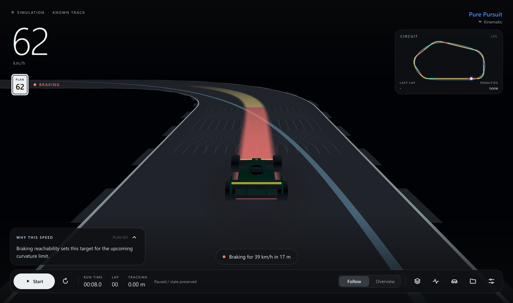

*Actual application capture at 1440×852, 8.0 s into a run, braking before the first corner: the red band is the
three-second prediction, the status line says what the car brakes for and where, and WHY THIS SPEED says what sets it.
The driver's display of [decision 0035](docs/decisions/0035-drivers-display.md); the feature screenshots further down
predate it and show the earlier layout of the same readouts, whose controls now open from the dock.*

## What runs

- One 507.56 m preset circuit, a kinematic bicycle and an autonomous lap using Pure Pursuit, and in the
  headless runner any closed centreline file, conditioned into a smooth track with continuous curvature.
- A minimum-curvature racing line solved with OSQP inside the track's corridor and the steering limit, driven by the
  same controller, prediction and planner, drawn beside the centreline with an estimated lap time for each.
- An offline lattice laid along whichever line the car drives: layers along it, nodes across the corridor, steerable
  edges between them with an offline cost, drawn faintly ahead of the car and searched by the lattice planner.
- Curvature speed limits with acceleration/braking propagation around the closed track.
- A three-second prediction from actual pose, speed and steering, recalculated at 50 Hz
  simulation control ticks and accepted grip changes. Its first command drives the car.
- A finite forward ribbon and local speed plot colored by predicted achieved acceleration;
  the circuit map retains the whole-track reference separately.
- A live grip control, target-speed explanations and green/yellow/red planned acceleration.
- A driver's display: a chase camera over a road that fades into the dark, speed and the plan's target at the top left,
  one line saying what the car is doing and why, and the settings, telemetry and scene layers opened from a dock; an
  overview, procedural appearances and Start/Pause/Reset.
- A headless experiment runner with source/config identity, revisioned plans, commands and events.
- Validated recording ingestion and seekable playback, restoring the plan revision and
  configuration each recorded sample was produced under.
- Local action selection by a lattice planner: at every control decision the car follows the reference line while it is
  clear; when a stated blockage blocks it, it takes the cheapest lattice path past the blockage on a clear side within the
  car's lateral grip, returns to the reference along the lattice, and brakes toward the widest gap when no path is clear.
  Every action it compares carries its own speed profile, made from the car's actual speed over that path's own curvature
  within the same limits the reference plan uses, and the car takes the clear action of least estimated time and drives
  that profile. The driving view draws each evaluated action's line in its own colour with its estimated time, and names
  the chosen action, its cost terms and by how much it wins. The earlier five-offset planner stays selectable for
  comparison.
- Model predictive contouring control as the alternative to that policy for the cars with tires: at every decision it
  optimises three seconds of the car's motion with the plant's own single-track equations to make the most progress
  along the chosen action's path within the corridor and each axle's slip angle and friction ellipse, and drives only
  while its plan passes the checks every prediction gets. Its plan is drawn as the ribbon, with the solver's status and
  solve time, and recordings say who drove each decision and keep each plan's commands, so that what its prediction
  model gets wrong is measured apart from its replanning. For the four-wheel car the tire slip card draws what each
  wheel has left of its friction circle along that plan, live or replayed.
- Three selectable vehicle models: the kinematic bicycle; a dynamic single-track model with tire
  forces that can slide, plus that car on softer front tires; and a car with four rotating wheels
  whose brakes and drive can lock and spin them, whose weight moves between its wheels as it
  brakes, accelerates and corners, and which has drag, optional downforce and an optional viscous
  coupling across each driven axle.
- A tire slip card for the models with tires: each axle's slip angle against its peak, understeer or
  oversteer with its definition, rear sideslip beside a velocity arrow at the car, and for the
  four-wheel car each wheel's state, load and tire force in its friction circle, and its drag and downforce.
- Two steering laws for either car with tires: Pure Pursuit geometry, or MAP, which steers by a
  table of that car's own steady turns and shows how far it departs from geometry. MAP with the four-wheel car's
  envelope speed plan is the baseline MPCC is measured against, on the same car and scenarios.
- Setup controls for the four-wheel car, each offered only because a test shows its effect, and that car's
  G-G-V performance envelope derived from the plant itself: exported in TUM's `ggv.csv` format, drawn live
  as a G-G diagram with the car's own acceleration inside it, and selectable as what the speed plan is made from,
  so the car's setup moves its planned speeds and braking points.
- The car's own instruments, late and noisy from a recorded seed, and simulated cone perception of the course's cones
  after PacSim's model, drawn against the truth: missed cones ringed, wrong colours crossed, each detection's ellipse.
- Driving on cones: the car follows the path it believes from its own detections, placed by the pose it reads, through
  a port of FaSTTUBe's cone path planner that reproduces the published package on saved cone sets and a memory of the
  cones it has placed. Every recording of such a run is checked by a driver run again on its readings and frames alone.
- Every run judged as a Formula Student official would, after PacSim: laps and sectors from the start line, cones down,
  off course, an unsafe stop, a DNF; and PacSim's Formula Student layouts driven from where they lie, on the known track
  or on cones.
- Drive it yourself with an Xbox controller (Settings, Driver: You): right trigger accelerates, left trigger brakes, the
  left stick steers with speed-sensitive steering, Menu starts and pauses. The same plant and judge, no speed cap but
  the car's own physics, and the autonomous plan left on the road as a guide. A person's drive is not recorded
  (decision 0037).
- Gokart mode, under You: Gokartcentralen Göteborg's indoor track, traced from the operator's poster and scaled to its
  published 400 m and checked against the poster by three independent agent judges (9, 9 and 9 of 10), driven with a
  Sodi RSX2 rental kart's physics (261 kg with its driver, 14 hp, a 60 km/h controller) while the chosen car keeps its
  looks at the kart's size (decision 0038). A full-lap coaching line follows the supplied poster: green gas, blue coast,
  red brake. Settings under Gokart and the Layers panel independently toggle Coaching line and Prediction line, even
  while driving; coaching starts on, prediction and the separately switchable motion arrow off.
  The poster advice is fixed, not adjusted to your speed (decision 0039).
  Under You, enable **Forgiveness** to learn with assistance: 100 gives planted arcade handling, strong brakes and
  35 km/h; 50 is still very easy; 1 or Off restores normal kart physics. The slider works while driving, keeps the actual
  car position, and overrides normal handling only while enabled (decision 0040).
  Choose **Manual** inside Forgiveness for independent 1–100 acceleration, braking, joystick steering, grip assistance
  and top-speed controls. **Overall** keeps the single-slider adjustment; switching modes remembers both choices
  (decision 0042).
  Five **Local presets** save the whole Forgiveness setup on this PC. Select 1–5, then Save, Load or Delete; Save becomes
  Replace for an occupied slot. Load enables the saved setup without restarting the lap. Presets survive app restarts
  in one local JSON file (decision 0043).
  The top-right practice clock starts with your first accelerator press, with the previous completed lap beneath it;
  the circuit card shows your session best. Pause freezes timing; restart returns to the checkered start and keeps
  completed times. Leaving kart mode clears the session (decision 0041).
  Under **You**, **Settings → Sound** plays a Formula V10 engine recording and tire samples from Speed Dreams,
  with seven virtual gears, upshift cuts, downshift blips and quiet road noise. The kart's full-lap clock triggers a pling or a
  rising session-best chime. Master volume, engine/tire and cue switches are remembered locally. These gears
  affect sound only; the vehicle physics stays the same (decisions 0044, 0045).
- Physics profiles for the four-wheel car from named sources, a Formula One car, a Formula Student car, TUM's electric
  race car and a racing kart, with every value marked published, derived, fitted or chosen.
- The theoretical best lap: a car's minimum-time lap of the corridor solved offline by fastest-lap, checked as a
  contract, cross-checked with TUM's formulation, and shown in the desktop as a translucent car with the live lap's
  delta per sector, each tire's dissipated energy and what a setup step would be worth, with its solver status always.

This is the first **internal planning/control milestone**, not the finished public showcase.
All four showroom appearances use the selected simulation model; they do not select manufacturer-specific physics. State and track are supplied perfectly by the
simulation, unless the car is told to drive on the cones it perceives. The default kinematic model has no mass or tire slip; the dynamic models have tire
forces and illustrative parameters, and only the four-wheel car moves load between its wheels, quasi-statically,
and feels drag and downforce. None has suspension or rolling resistance. By default every model is planned with fixed grip fractions that
know nothing of the car; the four-wheel car can instead be planned from 80% of its own performance envelope, a
reserve measured for this controller on this track. Perception is simulated from ground-truth cones, never real, and
driving on cones builds no map beyond a memory of placed detections; the racing line is minimum curvature, not minimum
time. The theoretical best lap is minimum time, but for fastest-lap's model offline, never driven: the controller does not
chase it, and a car whose tires grip less than fastest-lap's floor of 1.0 is solved only when that is stated. The planner compares
the actions it has by the time each one's own speed profile implies over one decision's horizon; it does not search the
lattice for the fastest path, so a faster path that is no action's cheapest is never seen, and without a blockage the
reference line is followed without alternatives. MPCC is not real time on this host, and it predicts the four-wheel car
on one track, without that car's lateral load transfer, brake bias or wheel speeds. Blocked regions are stated by the
scenario: nothing detects them, and none of them is a pedestrian. Playback reads this project's own run directories. ROS and rosbag2 remain planned.
The local [four-car Blender showroom](docs/SHOWROOM.md) opens before track setup and uses the user's supplied assets.
Its cars also drive on the track once built with `python tools/showroom/build_live_cars.py` (Blender 4.5 and the
prepared cars in `artifacts/showroom/cars/`; output in the ignored `artifacts/live-cars/`): textured bodies with their
decals, wheels steering and turning with the car and each wheel's slip, a contact shadow, and a soft reflection in the
road that the layers panel can hide (decision 0036). They are appearance only, drawn at their real sizes from the
plant's rear axle; without them the procedural silhouettes drive.

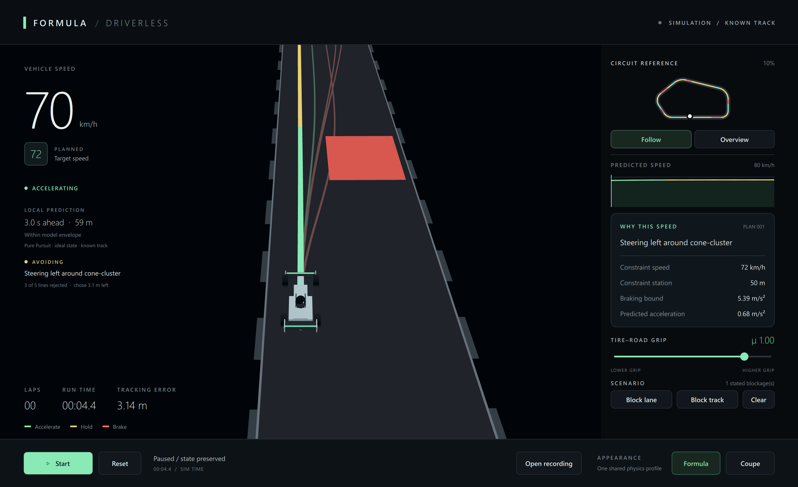

*Earlier capture of the five-offset planner at 4.4 simulation seconds. The red slab is the stated blocked
region. The bright line is the chosen path; the faint lines are the alternatives the planner
evaluated and rejected. The panel names the choice: three of five lines rejected, 3.1 m left.
The lattice planner that replaced it as the default is shown under the blocked-corridor scenario below.*

## Run on this Windows machine

The project-local Qt kit has already been installed and both builds have been verified.

With Python available, `python run.py` launches the same native application and
forwards any application arguments. The cinematic videos play in car selection;
selecting a car fades into paused track setup, where Start begins the simulator.

```powershell
.\scripts\run.ps1
```

Use **Start** to drive, **Pause** to inspect, **Reset** for a fresh run, and the grip slider
to change the plan. Space toggles running, R resets, V switches camera. Appearance changes
are available while paused. Grip changes made while paused are queued until the next tick;
the status tells you this. Reset preserves the last applied grip and cancels a queued edit.

**Local prediction** shows the next approximately three seconds, with distance depending
on speed. Green means increasing predicted speed, yellow means holding speed, red means
braking (±0.15 m/s²). The ribbon starts at the actual rear axle; it can deviate from the
centerline during correction. Its envelope indicator names predicted speed, grip or track
margin violations. This is a known-track prediction, not simulated sensor perception.

**Open recording** loads a run directory and switches to replay. Drag the playhead to seek,
or use the left and right arrow keys to step one second. Yellow marks on the playhead are
the recorded parameter changes at their simulation times. Seeking backward past one restores
the earlier plan revision and its configuration, and the grip slider shows the recorded value
rather than accepting edits. **Exit replay** returns to the live simulation, which is left
exactly where it was. A recording that fails validation is refused with the rule it violated.
New recordings keep every decision the car made (schema 2 and later). Replay shows the decision in force
at the playhead, the lines it rejected and the prediction ribbon it chose, all labelled as
recorded; nothing is recomputed. Schema 1 recordings, made before that, still replay: they hide
the ribbon and say **No recorded prediction**, while still showing recorded state and the
reference speed plan.

```powershell
.\build\core\apps\headless\Release\fd_headless.exe --obstruct 62:68:-4.5:1.0:cone-cluster --out out\runs\my-avoid
.\scripts\run.ps1 --replay out\runs\my-avoid --at-time 3
```

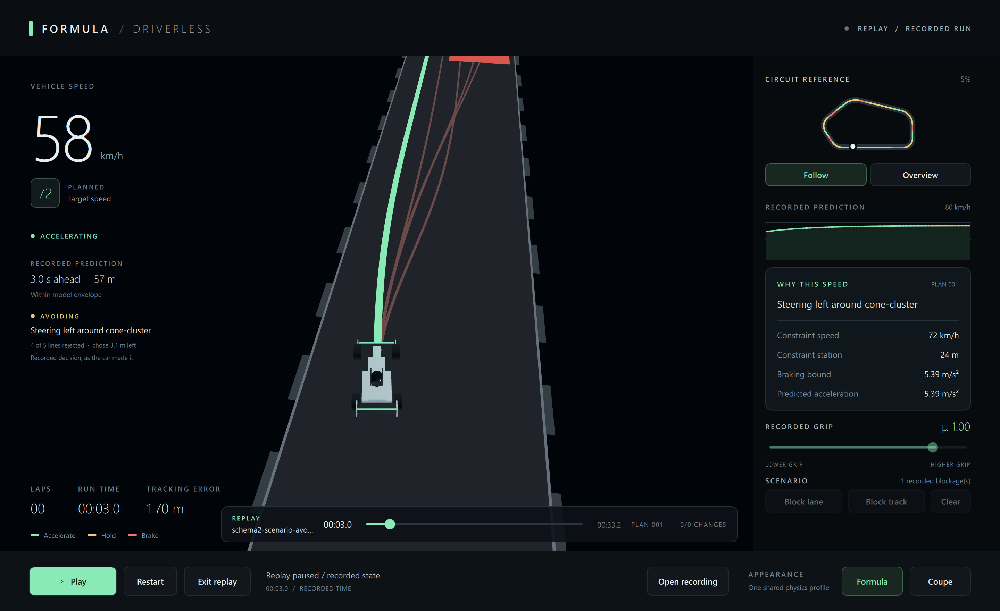

*Replay of a schema 2 run of the five-offset planner at 3.0 recorded seconds. The panel, the four rejected lines and the
green ribbon are the decision recorded at that moment, not a new computation. A schema 10 replay shows the recorded
lattice planner's action, path cost and each action's line the same way.*

```powershell
.\scripts\run.ps1 --replay out\runs\replay-demo
```

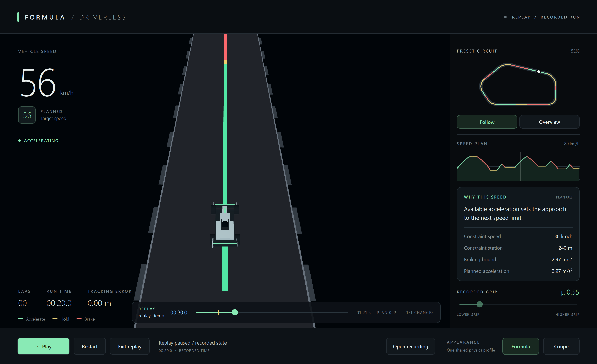

*Earlier replay milestone capture of `out/runs/replay-demo` at 20.0 recorded seconds. The
playhead marker at 12 s is the recorded grip change; plan revision 2 and μ 0.55 are active
because that is what the recorded sample was produced under. The current replay view
displays no prediction ribbon for this run, since schema 1 did not record one.*

Rebuild and verify:

```powershell
.\scripts\build.ps1 -Desktop
```

For a fresh machine, install Visual Studio 2022 with Desktop development with C++ and a
Windows SDK, CMake 3.24+, Python 3.10+ and uv. Then use:

```powershell
.\scripts\bootstrap-qt.ps1
.\scripts\bootstrap-osqp.ps1
.\scripts\bootstrap-audio.ps1
.\scripts\build.ps1 -Desktop
.\scripts\run.ps1
```

The bootstrap downloads Qt 6.8.3 for MSVC 2022 into ignored `.tools/`, with aqtinstall 3.3.0
in a local Python environment. `bootstrap-osqp.ps1` downloads the OSQP v1.0.0 and qdldl v0.1.8 sources the racing line
needs, checks their pinned SHA-256 hashes and places them in `.tools/osqp`; without them both builds still work, without
the racing line. `bootstrap-audio.ps1` fetches checksum-pinned engine/tire WAVs from Speed Dreams into ignored
`artifacts/audio/`; desktop builds embed them for offline playback. Credits and licenses are in
`assets/audio-licenses/` and `THIRD_PARTY_NOTICES.md`. It does not alter global PATH. See the script's help for an
explicit Python path. Qt Quick 3D's GPLv3/commercial terms are recorded in the
[licensing decision](docs/decisions/0001-native-portable-baseline.md); public packaging and
the project's own release license are not finalized.

## Reproduce the grip experiment

The headless build needs no Qt, ROS or Python:

```powershell
.\scripts\build.ps1
.\build\core\apps\headless\Release\fd_headless.exe --config configs\default.cfg --out out\runs\my-high
.\build\core\apps\headless\Release\fd_headless.exe --config configs\low-grip.cfg --out out\runs\my-low
```

Use a fresh output directory each time. Existing nonempty directories are rejected so old
plans cannot be mixed into a new recording; the writer also refuses a simulation that has
already been stepped. Optional comparison, using only Python's standard library:

```powershell
python tools\analysis\compare_grip.py out\runs\my-high out\runs\my-low
```

Measured on the same initial state, this preset and a 20 m/s cap:

| Grip μ | First lap | Maximum tracking error | Planned braking station | First corner speed |
| --- | ---: | ---: | ---: | ---: |
| 1.00 | 33.520 s | 0.267 m | 111.245 m | 10.712 m/s |
| 0.45 | 48.260 s | 0.197 m | 66.388 m | 7.186 m/s |

The first corner starts at station 138.159 m. Lower grip starts planned braking **44.857 m
earlier** in this scenario; neither nominal run violates the implemented validity checks.
This is measured simulation behavior, not real-car performance or a universal grip theorem.
The speed cap matters: an uncapped profile may scale with grip without moving its braking station.

The speed limit is `sqrt(0.65 * mu * g / abs(curvature))`. Longitudinal demand is bounded by
`0.55 * mu * g`; periodic forward/backward passes constrain reachable speeds. Color derives
from reference-segment acceleration with a ±0.15 m/s² deadband on the map; the live ribbon
uses the predicted achieved speed change over time with the same deadband.
[Model and frames](docs/ARCHITECTURE.md).

A sudden change is deliberately harder:

```powershell
.\build\core\apps\headless\Release\fd_headless.exe --grip-event 6:0.45 --out out\runs\my-grip-change
```

It does not teleport or instantly slow the car. This case reports a validity violation from
6.005 to 11.100 s before recovering. Its peak combined demand is 1.238 times available grip;
the kinematic plant cannot model the resulting real tire behavior. A completed run does not
mean all samples were valid: inspect `summary.json` and the recorded flags.

Each run contains `metadata.json`, `summary.json`, `telemetry.csv`, `track.csv`, `events.csv`
and `plan-rev-N.csv`. Metadata stores effective configuration and source/compiler identity;
events and plan revisions carry simulation timestamps. These are this project's own files,
read by its own reader; they are **not rosbag2 integration**.

## Reproduce the blocked-corridor scenario

`--obstruct FROM_S:TO_S:FROM_OFFSET:TO_OFFSET[:NAME]` states a blocked region in metres
along and across the track. The lattice planner chooses what to do about it by default
([lattice planner decision](docs/decisions/0022-lattice-planner.md)); `--local-planner five-offsets` restores the planner
it replaced. Three runs differing only by that statement, under the five-offset planner:

```powershell
.\build\core\apps\headless\Release\fd_headless.exe --local-planner five-offsets --laps 1 --out out\runs\my-baseline
.\build\core\apps\headless\Release\fd_headless.exe --local-planner five-offsets --laps 1 --obstruct 62:68:-4.5:1.0:cone-cluster --out out\runs\my-avoid
.\build\core\apps\headless\Release\fd_headless.exe --local-planner five-offsets --laps 1 --duration 30 --obstruct 62:68:-4.5:4.5:stalled-car --out out\runs\my-stop
```

| Run | First lap | Max tracking error | Peak grip use |
| --- | ---: | ---: | ---: |
| Clear corridor | 33.520 s | 0.267 m | 0.686 |
| Right side blocked | 33.240 s | 3.317 m | 0.995 |
| Full width blocked | no lap | 0.000 m | 0.550 |

The avoiding car passes the blockage at a recorded **+3.08 m** lateral offset while holding
19.8 m/s, against a blocked interval reaching +1.0 m. The baseline drives the same stations
at 0.000 m. The two lap times differ by 0.28 s; that is what these runs measured, not a
claim that avoiding is faster. Peak grip use reaches 0.995 of the modelled circle during
that lane change, so at higher speed or lower grip the same line would be rejected and the
car would brake instead. With the corridor fully blocked the car halts at station 61.78 m
against a blockage starting at 62 m, having rejected every line it evaluated.

The same lane blockage with the lattice planner, the default, drops `--local-planner`:

```powershell
.\build\core\apps\headless\Release\fd_headless.exe --laps 1 --obstruct 62:68:-4.5:1.0:cone-cluster --out out\runs\my-lattice-avoid
.\build\core\apps\headless\Release\fd_headless.exe --laps 1 --obstruct 130:136:-0.5:1.5:corner-bollard --out out\runs\my-lattice-corner
```

| Run (`out/runs/final2-*`) | Lattice planner | Five-offset planner |
| --- | --- | --- |
| Clear corridor, one lap | 33.52 s, peak grip 0.686 | the same telemetry, byte for byte |
| Right side blocked, one lap | passes at 2.33-2.53 m, 33.50 s, peak grip 0.684 in a later corner | passes at 3.07-3.08 m, 33.24 s, peak grip 0.995 turning back at 161 m |
| Full width blocked, -5 to 5 m | stops at 61.78 m | the same telemetry, byte for byte |
| Bollard, -0.5 to 1.5 m | passes right at 1.83-2.02 m, peak grip 0.706 | passes right at 1.64 m, peak grip 0.953 |
| Bollard entering the first corner, one lap | passes right, then left on the inside at 3.01-3.09 m, 33.49 s, peak grip 0.850 | passes left at 2.82-3.11 m, 33.26 s, peak grip 0.998 |

The lattice car turns out along lattice nodes within its lateral grip budget, keeps the part of its last path within a
pursuit distance so it does not keep deferring the turn, and returns along the lattice: from 60 m past the blockage it is
within 0.27 m of the reference, while at 142 m the five-offset car is still 3.32 m off, before turning back. Its lap was 0.26 s
slower here, which is what these runs measured. The four-wheel car on 80% of its envelope and the soft-front dynamic car
on MAP pass the same way without exceeding their clear runs' peak grip. With no path clear it brakes toward the widest
gap beside the blockage; across the whole width there is none, and it stops exactly as before.

Each action it compares is timed by its own speed profile, made from the car's actual speed over that path's own
curvature within the same limits the reference plan uses, to a horizon the whole decision shares, and the car drives that
profile ([speed profile decision](docs/decisions/0023-per-action-speed-profiles.md)). It takes the clear action of least
estimated time, keeping its previous choice while that is within 0.05 s of the fastest, so it does not swap sides on a
tie. Entering the first corner that changes which side it passes: the inside path costs 2.16e6 against the outside's
1.18e6 and is taken anyway, because its profile drives it 0.078 s faster. The estimate is close to what follows: the
first decision to pass the corner bollard estimated 3.210 s to its horizon and the car took 3.250 s, and in the other
scenarios each first pass was within 2% of the driven time. Past the blockage the car returns along the lattice or
rejoins the reference directly, whichever its profiles say is faster; if grip falls and neither is clear it keeps the
path it is on. Every run above passes `--check-recording`, which now also checks that the car took the fastest clear
action, or kept its previous choice within the margin.

In the application, **Block lane** and **Block track** place a region ahead of the car and
**Clear** removes it, or use `.\scripts\run.ps1 --obstruct 62:68:-4.5:1.0:cone-cluster`. **PLANNER** beside them
chooses the lattice or the five-offset planner while paused.

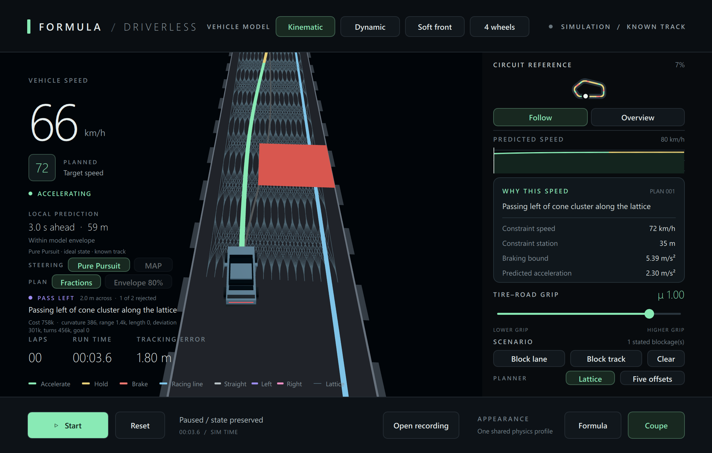

*Actual application capture at the 1100×700 minimum, 3.6 s into a run with the lane blocked: the green ribbon is the car's
prediction along its chosen lattice path, left of the red blockage; the dark line through the blockage is the rejected
reference line. The panel names the action, PASS LEFT, where it crosses the blockage, how many actions were rejected, and
the chosen path's cost term by term.*

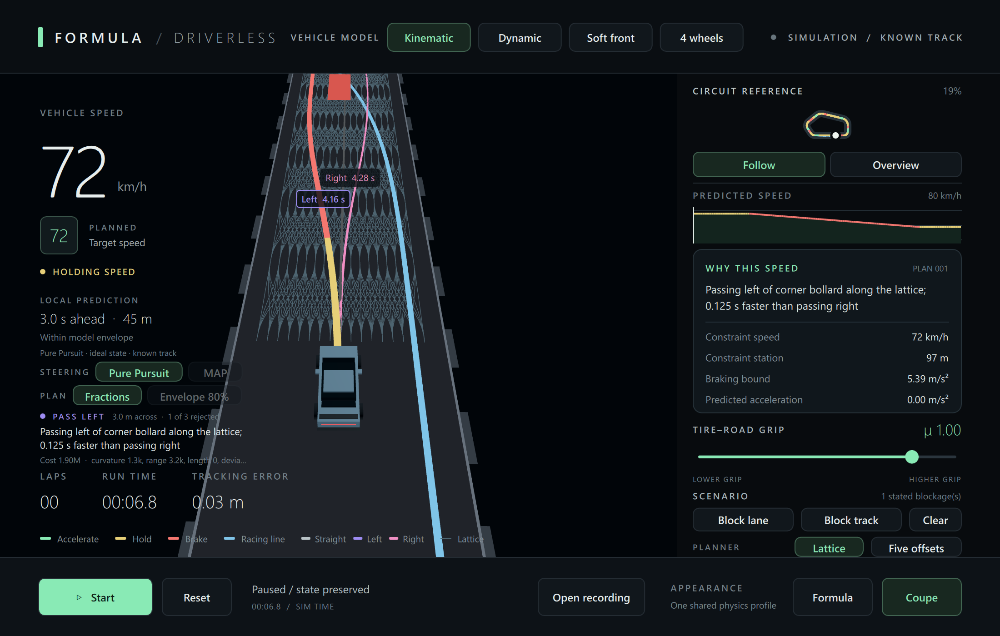

*Actual application capture at the 1100×700 minimum, 6.8 s into a run with a bollard stated entering the first corner.
Both ways past it are clear, so each is drawn in its own colour and labelled with the time its own speed profile takes to
the decision's horizon: Right 4.28 s, and Left 4.16 s framed as the choice. The panel says the same in words, and the
prediction ribbon is red because the car is braking for the corner either way.*

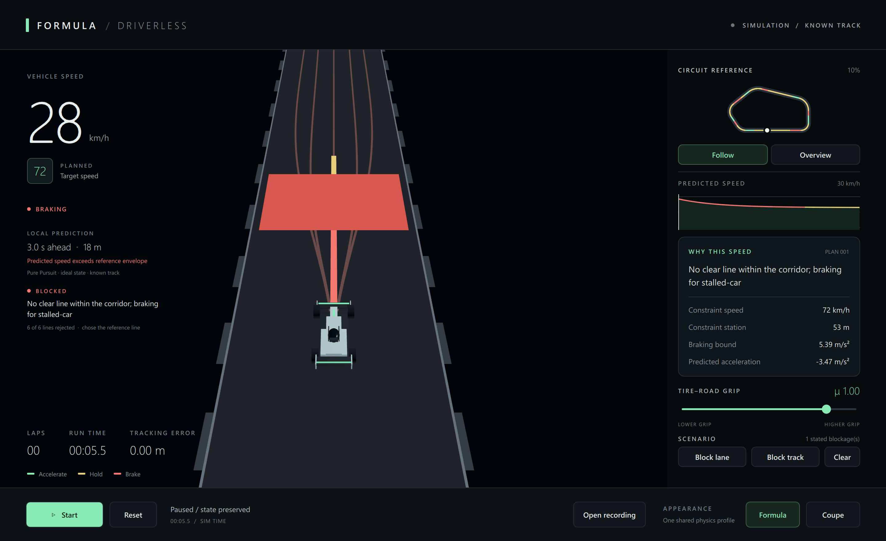

*Earlier capture of the five-offset planner at 5.5 simulation seconds with the corridor fully blocked. All six evaluated
lines were rejected, so the car holds the reference line and brakes. With the whole corridor, -5 to 5 m, blocked, the
lattice planner stopped at the same 61.78 m as the five-offset planner.*

A blocked region is scenario ground truth, written into the run's metadata so a recording
states the scenario it ran against. Nothing detects, classifies or tracks it. Contact is
tested at the predicted control points against a sampled rectangle inflated by a vehicle
half-width, so a clear result is not swept-body collision checking or a safety guarantee.

## Drive the dynamic plant

The dynamic single-track model computes tire forces from slip angles, keeps each axle inside its
friction ellipse and can slide. Select it under **Vehicle model** in the desktop's Settings while paused, or:

```powershell
.\build\core\apps\headless\Release\fd_headless.exe --plant dynamic --out out\runs\my-dynamic
.\build\core\apps\headless\Release\fd_headless.exe --plant dynamic --drive-front-fraction 0 --duration 40 --out out\runs\my-rear-drive
```

Measured on this preset with the default configuration and unchanged controller:

| Model | First lap | Max tracking error | Max rear sideslip | Invalid samples |
| --- | ---: | ---: | ---: | ---: |
| Kinematic bicycle | 33.520 s | 0.267 m | 0 | 0 |
| Dynamic, drive shared by load | 33.795 s | 0.350 m | 0.042 rad | 0 |
| Dynamic, rear-wheel drive | no lap in 40 s | 9.006 m | 1.439 rad | 5538 of 8001 |

The rear-wheel-drive car spins leaving the first corner: the controller asks for more
acceleration than one axle can deliver without load transfer, so the rear tires spend all their
grip on traction. That is power-on oversteer, and it is why the default shares drive by load
([plant decision](docs/decisions/0008-dynamic-single-track-plant.md)).

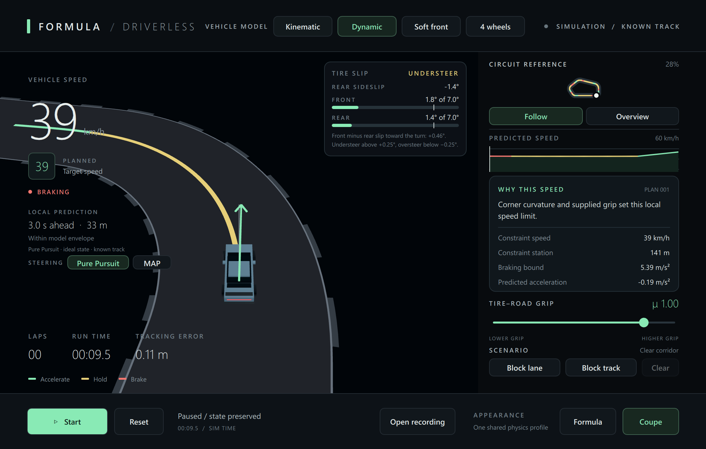

*Actual application capture at the 1100×700 minimum, 9.5 s into a dynamic run: the Vehicle model
choice in the header, and the tire slip card with 1.4° of rear sideslip and each axle's slip angle
against its peak. Braking into the corner, the default car reads UNDERSTEER at +0.46°; in a steady
coasting turn it is neutral.*

## Steer with MAP

Pure Pursuit turns the arc to its target into steering by geometry, which assumes the tires do not
slip. MAP keeps the same target and arc, and asks a table of the plant's own steady turns which
steering holds that curvature at the current speed. The table is solved from the plant that drives,
kept only where the car can hold the turn, and fingerprinted so a table for another car or grip is
refused ([steering decision](docs/decisions/0010-map-steering.md)). The four-wheel car's wheel speeds
and loads are solved with its turns, so it has a table too
([head-to-head decision](docs/decisions/0026-head-to-head.md)).

The default dynamic car is nearly neutral, so its steady steering is almost geometry and MAP
changes little. **Soft front** puts it on softer front tires, so it understeers. In the desktop,
choose **Soft front** in the header and **MAP** under the local prediction while paused; the
**MAP correction** line of the tire slip card shows how much further MAP steers than geometry. Or:

```powershell
.\build\core\apps\headless\Release\fd_headless.exe --plant dynamic --car soft-front --laps 2 --out out\runs\my-soft-pursuit
.\build\core\apps\headless\Release\fd_headless.exe --plant dynamic --car soft-front --laps 2 --steering map --out out\runs\my-soft-map
```

Measured over two laps on this preset:

| Car and cornering | Steering | Max tracking error | RMS tracking error | RMS above 0.5 g |
| --- | --- | ---: | ---: | ---: |
| Soft front, default | Pure Pursuit | 0.709 m | 0.310 m | 0.470 m |
| Soft front, default | MAP | 0.332 m | 0.158 m | 0.226 m |
| Soft front, `configs\hard-cornering.cfg` | Pure Pursuit | 0.993 m | 0.402 m | 0.627 m |
| Soft front, `configs\hard-cornering.cfg` | MAP | 0.436 m | 0.192 m | 0.286 m |
| Default car, `configs\hard-cornering.cfg` | Pure Pursuit | 0.501 m | 0.204 m | 0.307 m |
| Default car, `configs\hard-cornering.cfg` | MAP | 0.530 m | 0.205 m | 0.310 m |

MAP halves the understeering car's error. On the default car it is no better, and at its limit it
can be slightly worse: MAP never asks for more than the largest steady turn, while geometry briefly
does. MAP is a steady-state correction, so it does not model transients, and it does not stop a
rear-wheel-drive car spinning under power.

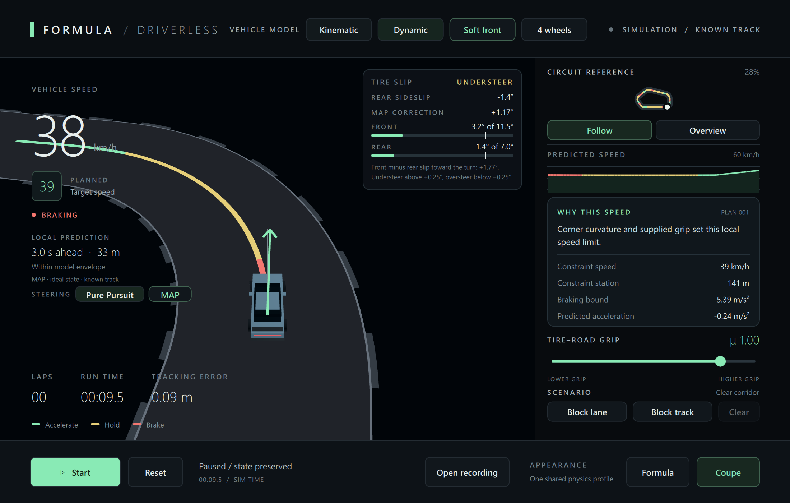

*Actual application capture at the 1100×700 minimum, 9.5 s into a MAP run on the soft-front car:
MAP selected under the local prediction, and MAP steering 1.17° more than geometry in the corner. The
card labels the car UNDERSTEER: its front tires slip 1.77° more than its rear
([balance decision](docs/decisions/0011-tire-slip-and-balance.md)), and the arrow at the car points
along its velocity, 1.4° from its heading.*

## Lock the wheels

**4 wheels** is a car with four rotating wheels: every wheel has its own speed, slip ratio and slip
angle, the brakes are shared by a bias, and driving is limited by power. The controller's acceleration
is applied as wheel torque, so a wheel locks or spins exactly when its torque exceeds what its tire
can transmit ([wheel decision](docs/decisions/0012-four-rotating-wheels.md)). Its load moves between
the wheels quasi-statically: braking at `a` moves `m·a·h/L` onto the front axle, cornering at `a_y`
moves `m·a_y·h/track` onto the outer wheels, and the roll balance splits that between the axles
([load transfer decision](docs/decisions/0014-quasi-static-load-transfer.md)). The centre of gravity is
0.35 m high by default; `--cg-height 0` gives back the car without load transfer, exactly.

```powershell
.\build\core\apps\headless\Release\fd_headless.exe --plant four-wheel --out out\runs\my-wheels
.\build\core\apps\headless\Release\fd_headless.exe --plant four-wheel --brake-bias-front 0.1 --laps 0 --duration 20 --out out\runs\my-rear-lock
.\build\core\apps\headless\Release\fd_headless.exe --plant four-wheel --cg-height 0.75 --roll-balance-front 1 --out out\runs\my-tall-car
.\build\core\apps\headless\Release\fd_headless.exe --check-recording out\runs\my-rear-lock
```

Measured on this preset, 20 s runs except the laps:

| Car | Result | Samples with a wheel locked | With a wheel lifted | Invalid samples |
| --- | --- | ---: | ---: | ---: |
| Default, one lap | 33.810 s; front axle up to 578 N above its load at rest | 0 | 0 | 0 of 6763 |
| Brake bias front 0.9 | no lock | 0 | 0 | 19 of 4001 |
| Brake bias front 0.6 | no lock | 0 | 0 | 0 of 4001 |
| Brake bias front 0.1 | rear wheels lock at 7.99 s, spins to 1.14 rad of sideslip | 362 | 0 | 1062 of 4001 |
| Brake bias front 0 | rear wheels lock at 7.86 s, spins to 1.34 rad | 404 | 0 | 911 of 4001 |
| 0.75 m high, all roll transfer on the front, one lap | 33.805 s; inner front wheel lifts in corners | 0 | 2155 | 3219 of 6762 |

Braking moves weight off the rear wheels, so a rear-heavy brake bias locks them sooner than it did
without load transfer: at 10% front bias the car with its centre of gravity on the ground never locked,
and this one spins. The test suite shows the same at the limit. At 0.95 g the static bias of 0.5 locks the
rear wheels and stops in 25.6 m, while the bias matched to the braking load, 0.62, locks nothing and stops
in 22.0 m. It also shows threshold braking stopping shorter than locked braking, a front-locked car running
straight on, the power limit capping acceleration at speed, and a forward roll balance making the car
understeer near its limit.

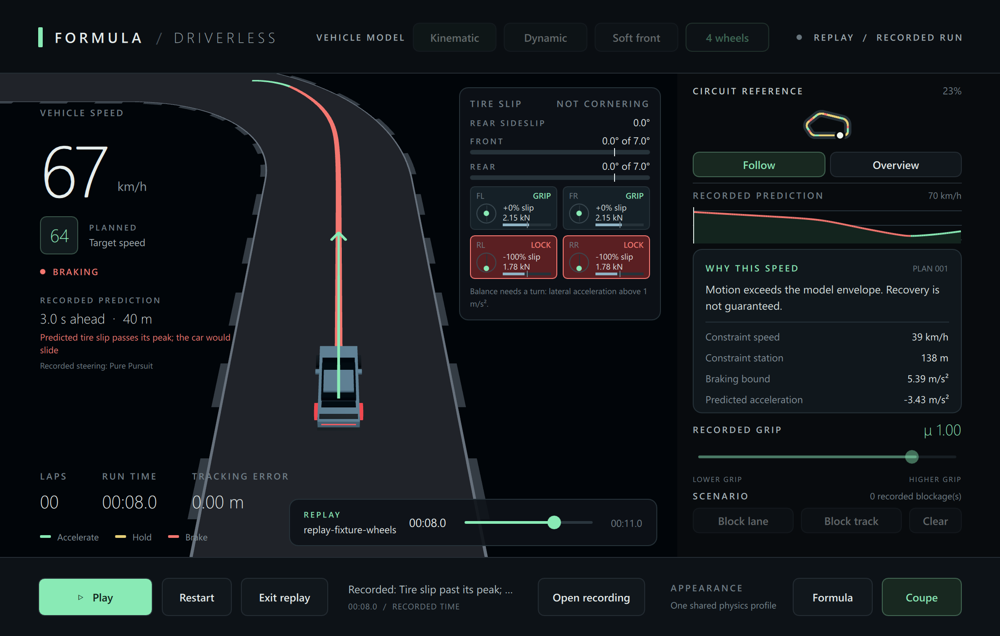

*Actual application capture at the 1100×700 minimum, replaying a run with all braking on the rear axle:
at 8.0 s the RL and RR tiles read LOCK at a slip ratio of -100%, their friction points sit at the bottom
of the circle, and they carry 1.78 kN each against 2.15 kN on the front wheels, whose load bars pass the
tick at their load at rest. The car's rear tires are drawn red.*

### Air and the differential

The four-wheel car has drag, by default a road car's 0.6 m² of drag area, and can be given downforce and a
viscous coupling across each driven axle ([aerodynamics decision](docs/decisions/0015-aerodynamics-and-viscous-coupling.md)).
`--drag-area 0` gives back the car of the previous section exactly.

```powershell
.\build\core\apps\headless\Release\fd_headless.exe --plant four-wheel --downforce-area 3 --aero-balance-front 0.45 --out out\runs\my-winged
.\build\core\apps\headless\Release\fd_headless.exe --plant four-wheel --drive-front-fraction 0 --viscous-coupling 40 --out out\runs\my-coupled
```

Measured on this preset, one lap each:

| Car | Lap | Max tracking error | Largest grip use | Max rear sideslip | Invalid samples |
| --- | ---: | ---: | ---: | ---: | ---: |
| No drag | 33.810 s | 0.353 m | 0.844 | 0.043 rad | 0 of 6763 |
| Default, 0.6 m² of drag area | 34.045 s | 0.344 m | 0.826 | 0.041 rad | 0 of 6810 |
| 3 m² of downforce area | 34.045 s | 0.331 m | 0.794 | 0.037 rad | 0 of 6810 |
| Rear-wheel drive, open differentials | 34.250 s | 0.365 m | 1.000 | 0.069 rad | 926 of 6851 |
| Rear-wheel drive, 40 N·m·s/rad coupling | 34.215 s | 0.728 m | 1.000 | 0.107 rad | 771 of 6844 |

Drag costs 0.24 s over a lap. Downforce leaves the lap time alone, because the speed plan does not know it
exists, but the car uses less of its grip; in the test suite it raises the largest steady turn at 30 m/s
from 8.86 to 10.77 m/s². On rear-wheel drive the open differentials let the unloaded inner rear wheel spin
up to 94 rad/s faster than the outer one; the coupling holds them within 2.5 rad/s, which gives fewer
samples past the tire peaks but more power oversteer. The test suite measures the same trade: a coupling
accelerates harder out of a corner at 0.45 g, and at 0.6 g spins both rear wheels and slides further.

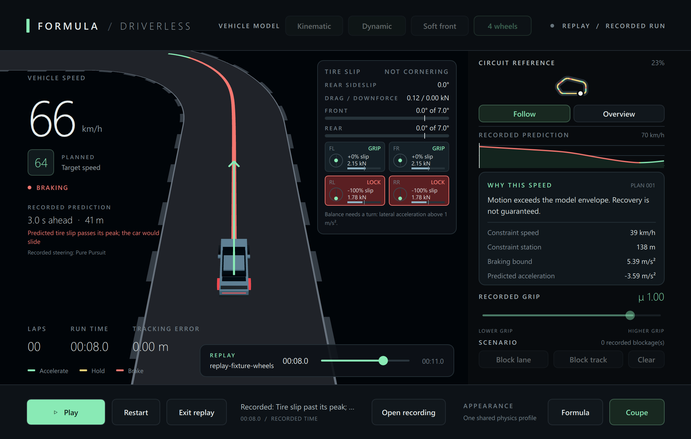

*Actual application capture at the 1100×700 minimum, replaying the rear-braked run with the default drag:
DRAG / DOWNFORCE reads 0.12 / 0.00 kN at 66 km/h.*

### Set up the car

The four-wheel car's setup can be changed between runs: **Car setup** under the TIRE SLIP card opens a panel
with mass, centre of gravity height, brake bias, drag and downforce areas, power and the viscous coupling
([setup decision](docs/decisions/0016-honest-setup-controls.md)). Pause to change a value; releasing a slider
starts a fresh run on the new car. Each control is offered only because a test shows it changes a measured
outcome on a fixed scenario, and the panel names that outcome. In the headless runner the same controls are
`--mass`, `--cg-height`, `--brake-bias-front`, `--drag-area`, `--downforce-area`, `--max-power-kw` and
`--viscous-coupling`.

| Change from the default car | Lap | Measured on the first 12 s |
| --- | ---: | --- |
| None | 34.045 s | grip use 0.826 |
| 600 kg / 1400 kg | 34.130 s / 34.190 s | grip use 0.805 / 0.868 |
| 0.6 m centre of gravity height | 34.045 s | front axle braking load 4891 N against 4087 at 0.1 m |
| 20% front brake bias | rear wheels lock | 102 samples with the rear locked |
| 1.5 m² drag area | 34.340 s | 2 m less distance than without drag |
| 4 m² downforce area | 34.025 s | grip use 0.788 |
| 40 kW | 34.840 s | 15 m/s at 3.29 s against 2.91 |
| 80 N·m·s/rad coupling | 34.175 s | understeer angle up to 0.034 rad against 0.010 |

The speed plan does not yet know the car, so its braking points stay where they are; what moves is how the car
copes with them. A stiff coupling makes planning decisions about two and a half times slower.

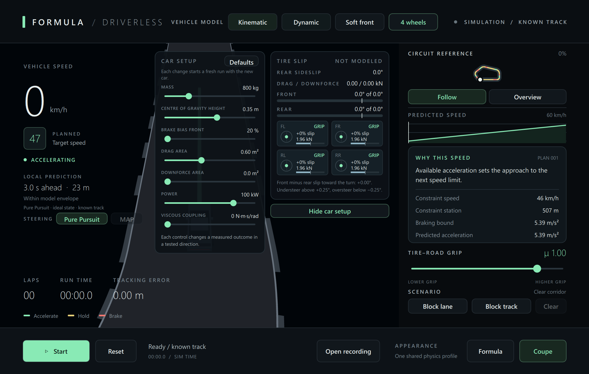

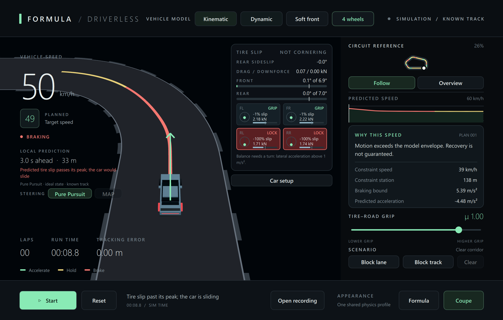

*Actual application captures at the 1100×700 minimum: the panel after moving brake bias to 20%, and the same
car 8.8 s later with its rear tiles reading LOCK braking into the first corner.*

### The car's envelope

The four-wheel car's G-G-V envelope is derived from the plant itself
([envelope decision](docs/decisions/0017-performance-envelope.md)): at each speed from 4 to 24 m/s the car is held at
speed while steering is swept until a turn can no longer settle with every tire within its peak, and from settled
turns at fixed fractions of that limit the largest forward and braking commands are probed. It takes a little over a
second per car. The desktop draws it beside the TIRE SLIP card as a G-G diagram at the current speed, with the car's
own acceleration as a dot, derived again whenever the car, its setup or the grip changes. The headless runner writes it
without driving a lap:

```powershell
build/core/apps/headless/Release/fd_headless.exe --plant four-wheel --downforce-area 3 --write-envelope out/envelope-downforce-3
```

That writes `envelope.csv` with every speed, side and level, and TUM's `ggv.csv` and `ax_max_machines.csv`, each
naming the envelope's fingerprint. Derived on this machine, accelerations in m/s²:

| Car | Lateral limit at 16 m/s | Forward at 8 / 16 m/s | Braking at 8 / 24 m/s |
| --- | ---: | ---: | ---: |
| Default | 9.36 | 7.73 / 6.89 | 7.77 / 8.15 |
| 3 m² downforce area | 10.02 | 7.85 / 6.92 | 7.86 / 9.07 |
| 70% front brake bias | 9.36 | 7.73 / 6.89 | 8.21 / 8.49 |
| 0.6 m centre of gravity height | 9.00 | 6.75 / 6.67 | 6.79 / 7.16 |
| 1200 kg | 9.06 | 7.54 / 4.78 | 7.56 / 7.80 |
| Grip 0.7 | 6.58 | 5.77 / 5.76 | 5.81 / 6.22 |

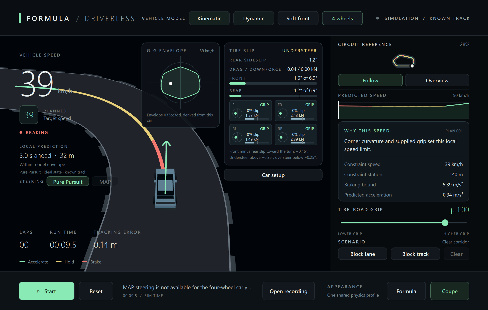

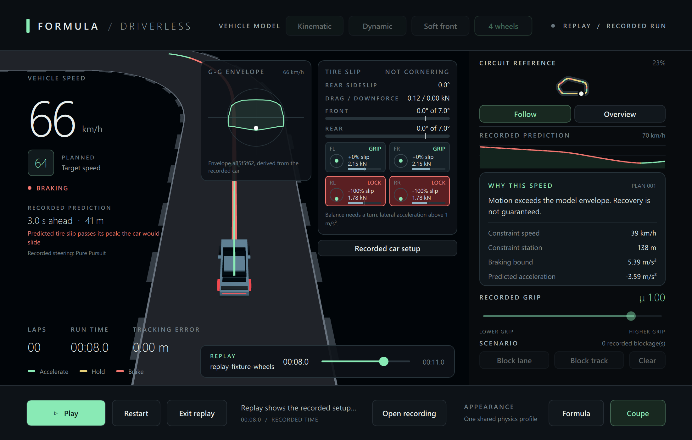

*Actual application captures at the 1100×700 minimum. Live: the default car at 39 km/h in a left turn, envelope
`033cc3dd`, the same fingerprint the headless runner derives. Replay: a recorded car braking only on its rear axle,
envelope `a85f5f62`; it can brake at most 4.3 m/s² with its tires within their peak, and with both rear wheels locked
it decelerates at 3.59, inside the boundary, because a sliding tire gives less than its peak. The diagram shows
accelerations; the tire slip card shows whether the tires are past their peak.*

Brake bias moves only braking; downforce raises lateral and braking capacity with speed; a taller car loses all three;
a heavier one loses most where power binds. At 4 m/s the limit is not grip: the front wheels steer in parallel, so the
outer front tire scrubs to its peak at 3.3 m/s².

### Plan speed from the envelope

The four-wheel car's speed can be planned from its own envelope instead of the fixed grip fractions
([envelope plan decision](docs/decisions/0018-envelope-speed-plan.md)): **PLAN / Envelope 80%** under STEERING in the
desktop while paused, or `--speed-plan envelope` in the headless runner. Corners are capped where the car's lateral
limit is, braking and acceleration follow what the car can do at that speed and lateral acceleration, and the
controller may brake as hard as the car can rather than as the grip fraction allows, and drive as hard as it can at the
lateral acceleration the reference asks. The plan uses 80% of the
envelope: planned with all of it, Pure Pursuit turns in before each corner while still braking and drives a tighter line
than the reference, and a tire passed its peak in about 9% of samples.

```powershell
build/core/apps/headless/Release/fd_headless.exe --plant four-wheel --speed-plan envelope --laps 2 --out out/runs/plan-envelope
```

Two laps on the preset, standing lap then flying lap:

| Car and plan | Laps | Braking for the first corner from | Invalid samples |
| --- | ---: | ---: | ---: |
| Default, grip fractions | 34.05 / 32.35 s | 111.2 m | 0 |
| Default, 80% of its envelope | 31.95 / 30.70 s | 116.6 m | 0 |
| Default, all of its envelope (`--envelope-fraction 1`) | 30.33 / 29.02 s | 122.6 m | 1091, tires past their peak |
| Brake bias 62% front | 31.83 / 30.61 s | 120.2 m | 0 |
| Centre of gravity 0.6 m high | 32.66 / 31.26 s | 113.0 m | 97, tires past their peak |
| 1200 kg | 32.55 / 31.30 s | 115.4 m | 0 |
| 3 m² downforce area | 31.49 / 30.25 s | 117.8 m | 0 |
| Grip 0.7, grip fractions | 39.58 / 37.39 s | 95.7 m | 0 |
| Grip 0.7, 80% of its envelope | 36.18 / 34.71 s | 105.9 m | 0 |

The share is not a guarantee: the tall car still passes a tire's peak turning in under braking. The plan follows the
line it is given: the centreline by default, or the racing line below.

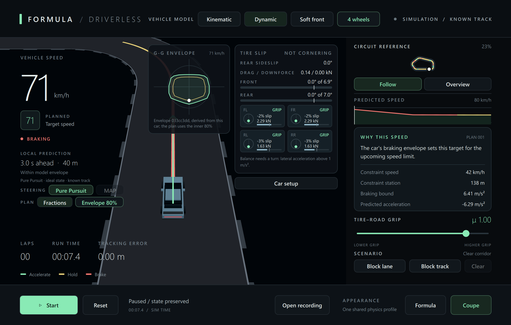

*Actual application capture at the 1100×700 minimum: the default car braking at 6.3 m/s² into the first corner, beyond
the grip fractions' 5.39 m/s² bound. WHY THIS SPEED names the car's braking envelope; the G-G diagram draws the
envelope and, inside it, the 80% the plan uses.*

## Drive a traced centreline

A closed centreline, traced from a map or drawn, can replace the preset in the headless runner
([conditioning decision](docs/decisions/0019-track-conditioning.md)). The file holds one `x_m,y_m` pair per line in
driving order; `#` starts a comment and one header line is allowed. The runner fits the smoothest closed curve that stays
within `--track-smoothing` (root-mean-square distance, default 0.1 m) of the points, resamples it every 0.6 m with
continuous curvature, and refuses it, before writing anything, if it crosses itself, bends tighter than half
`--track-width` (default 10 m) or passes closer to itself than the width:

```powershell
build/core/apps/headless/Release/fd_headless.exe --track out/tracks/foundry-traced.csv --plant four-wheel --speed-plan envelope --laps 2 --out out/runs/traced-envelope
```

Run on Foundry Circuit itself, two laps each (standing lap / flying lap):

| Track and plan | Laps | Tracking error | Invalid samples |
| --- | ---: | ---: | ---: |
| Preset, 80% of the envelope | 31.95 / 30.70 s | 0.51 m | 0 |
| Conditioned preset, 80% of the envelope | 31.12 / 29.79 s | 0.35 m | 0 |
| Trace with 0.1 m of noise, conditioned, 80% of the envelope | 31.27 / 29.95 s | 0.40 m | 0 |
| Preset, grip fractions | 34.05 / 32.35 s | 0.34 m | 0 |
| Conditioned preset, grip fractions | 32.31 / 30.45 s | 0.43 m | 562, tires past their peak |
| Trace, kinematic bicycle | 31.94 / 30.13 s | 0.24 m | 0 |

Conditioning turns the preset's curvature steps into ramps, so speed carries into corners. That also exposes the grip
fraction plan's separate lateral and braking caps: braking now runs into the curvature ramp, and the four-wheel car is
asked for more than it has; the envelope plan combines the two. The desktop drives the preset or its racing line, and
a recording made on a conditioned track replays as any other.

## Drive the racing line

The racing line is the least-curved line the car can drive inside the track
([racing line decision](docs/decisions/0020-minimum-curvature-racing-line.md)). Each sample of the conditioned
centreline may move sideways; the summed squared curvature is minimised with OSQP, keeping the car's 0.9 m half width and
a 0.6 m margin (`--line-margin`) inside the corridor and every curvature within the steering limit, and the line is
re-linearised until no sample moves more than 0.02 m. It is solved before the run, printed, then driven and recorded
with each sample's distance to the corridor's edges. In the desktop, **LINE / Racing line** under PLAN starts a fresh
run on it while paused.

```powershell
.\scripts\bootstrap-osqp.ps1
build/core/apps/headless/Release/fd_headless.exe --line racing --plant four-wheel --speed-plan envelope --laps 2 --out out/runs/my-racing-line
```

```
Racing line: Foundry Circuit racing line, 6 iterations, converged (last shift 0.019 m), derived in 1.141 s; 503.387 m against the centreline's 506.843 m; peak curvature 0.029 against 0.060 1/m; estimated lap with the performance envelope plan 26.204 s against 29.396 s
```

Two laps from `out/tracks/foundry-centreline.csv` (standing lap / flying lap), the four-wheel car unless noted:

| Line and plan | Laps | Tracking error | Invalid samples |
| --- | ---: | ---: | ---: |
| Conditioned centreline, 80% of the envelope | 31.12 / 29.79 s | 0.35 m | 0 |
| Racing line, 80% of the envelope | 28.05 / 26.60 s | 0.45 m | 0 |
| Racing line, 0.6 m high centre of gravity | 28.59 / 26.92 s | 0.41 m | 0 |
| Racing line, grip 0.7 | 30.63 / 28.75 s | 0.56 m | 361, tires past their peak on corner entry |
| Racing line, 0.3 m margin | 28.07 / 26.62 s | 0.44 m | 250, outside the corridor's margin |
| Racing line, grip fractions | 29.57 / 30.02 s | 18.93 m | 3140, the car spins |
| Racing line, kinematic bicycle | 28.80 / 26.88 s | 0.08 m | 0 |

The line reaches the corridor's edge through the corners, halves the peak curvature and saves about 3.2 s a lap. Only
the envelope plan drives the four-wheel car on it cleanly: the grip fractions' separate caps ask for more than it has.
Pulling away from rest on the line's curve first spun the inside wheel, so with an envelope the controller now bounds
driving by what the car has left at the lateral acceleration the line asks. Stated blockages are placed across the
centreline, so they are refused on the racing line.

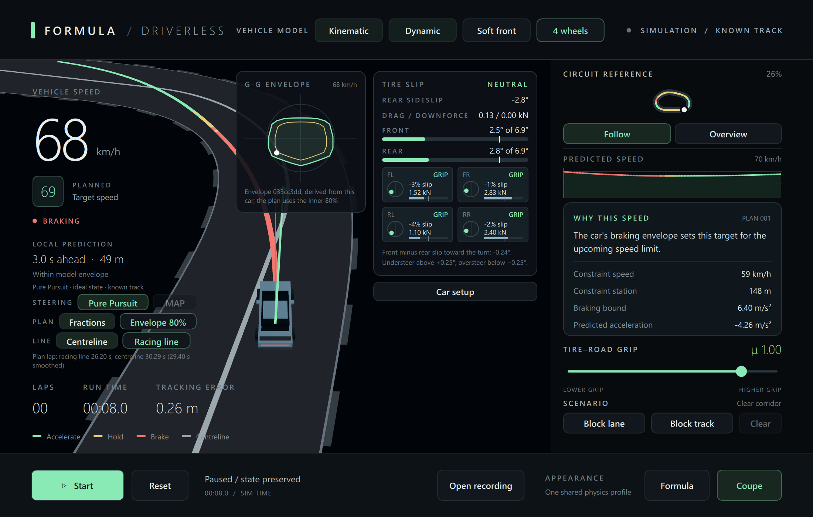

*Actual application capture at the 1100×700 minimum, 8 s into a run on the racing line at 80% of the envelope: the
car's prediction cuts toward the corner's inside while the grey centreline runs down the middle of the road. Under LINE
the plan's estimated lap is given for the racing line, the preset centreline and the smoothed centreline the line was
solved against.*

## Lay the lattice

The lattice is what a local planner will choose among a few metres at a time
([lattice decision](docs/decisions/0021-offline-lattice.md)), after TUM's graph-based local planner (Stahl et al. 2019),
reimplemented: layers along the line every 6 m, 4 m where it curves; nodes every 0.5 m across the corridor less the car's
0.9 m half width; an edge from each node to each node of the next layer within 0.3 m of sideways movement per metre,
removed if the car cannot steer it or it leaves the corridor, then dead ends; each edge with an offline cost for its
curvature and its distance from the line. An edge's offset is a quintic in distance along the line that leaves and
reaches each node with that node's slope. Where the racing line crosses the track, a node's slope follows the corridor, so
a path can keep its place on the track instead of following the line across it. The headless runner writes it without a
lap; the desktop draws the part within 60 m ahead of the car.

```powershell
build/core/apps/headless/Release/fd_headless.exe --line racing --write-lattice out/lattices/my-racing-line
```

That writes `lattice.json` with the counts and options, `layers.csv`, `nodes.csv`, `edges.csv` with each edge's length,
peak curvature and cost, and `edge_samples.csv` with every edge's points. Laying it takes under 0.01 s.

Laid on this machine along Foundry Circuit's lines, with the defaults:

| Line | Layers | Usable nodes | Edges kept | Removed: steering / corridor / dead ends |
| --- | ---: | ---: | ---: | ---: |
| Preset centreline | 100 | 1700 of 1700 | 7722 of 9412 | 1690 / 0 / 0 |
| Conditioned centreline, `--track out/tracks/foundry-centreline.csv` | 100 | 1700 of 1700 | 7720 of 9380 | 1660 / 0 / 0 |
| Racing line of the preset, `--line racing` | 96 | 1585 of 1586 | 7034 of 8889 | 1854 / 0 / 1 |
| Racing line of the noisy trace | 97 | 1604 of 1604 | 6982 of 8901 | 1919 / 0 / 0 |
| Racing line with a 0.3 m margin | 97 | 1576 of 1583 | 6815 of 8780 | 1951 / 1 / 13 |

Following the racing line's own heading at every node, as ForzaETH's configuration of TUM's planner does, left only
1075 of its 1785 nodes usable at 3 m corner spacing: a path could not keep its place on the track while the line crossed
it. The lattice planner searches it whenever a blockage is stated.

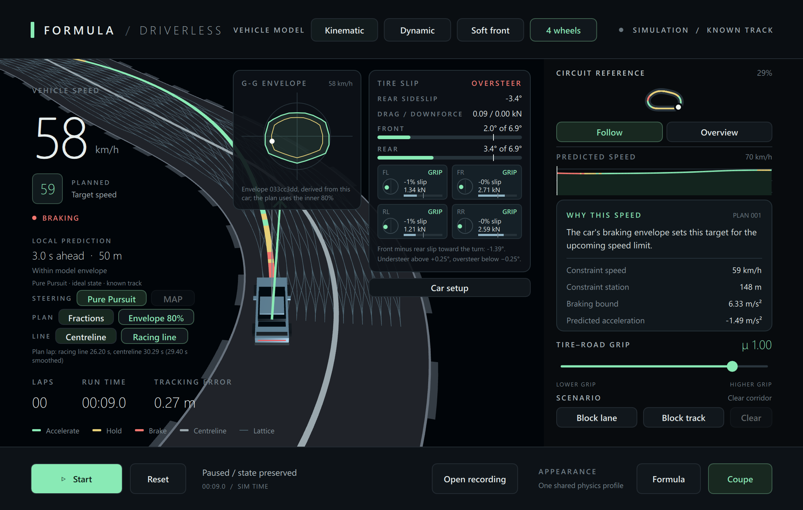

*Actual application capture at the 1100×700 minimum, 9 s into a run on the racing line: faint lines are the lattice's
edges from the layers within 60 m ahead of the car, fanning across the corridor; the green ribbon is the car's own
prediction and the grey line the centreline.*

## Drive with MPCC

Model predictive contouring control can drive the action the planner chooses instead of the policy
([MPCC decision](docs/decisions/0024-model-predictive-contouring-control.md)), after Liniger's MPCC, reimplemented. At
every decision it optimises three seconds of the car's motion with the plant's own single-track equations, to make the
most progress along the chosen path inside the corridor that path leaves open, keeping each axle's slip angle within 0.7
of its peak and its forces within 0.95 of its friction ellipse. It solves with OSQP, so it needs the same sources as the
racing line, and it drives the cars with tires: the kinematic bicycle has none to predict with, and is refused. Its plan
drives only while it is solved, inside the corridor and clear of every blockage; otherwise, and when holding for a
blockage, the policy drives, and the recording says who drove each decision and why. In the desktop, **CONTROL / MPCC**
while paused.

```powershell
build/core/apps/headless/Release/fd_headless.exe --plant dynamic --controller mpcc --laps 2 --out out/runs/my-mpcc
build/core/apps/headless/Release/fd_headless.exe --check-recording out/runs/my-mpcc
```

On the preset, standing lap / flying lap where two were driven:

| Car and controller (`out/runs/p62-*`) | Laps | Max tracking error | Peak grip use | Invalid samples |
| --- | ---: | ---: | ---: | ---: |
| Dynamic car, Pure Pursuit | 33.80 / 32.13 s | 0.35 m | 0.750 | 0 of 13186 |
| Dynamic car, MAP | 33.78 / 32.10 s | 0.35 m | 0.751 | 0 of 13178 |
| Dynamic car, MPCC | 26.66 / 25.26 s | 3.74 m | 0.950 | 0 of 10384 |
| Soft front, Pure Pursuit | 33.94 / 32.26 s | 0.71 m | 0.761 | 0 of 13241 |
| Soft front, MAP | 33.85 / 32.18 s | 0.33 m | 0.747 | 0 of 13207 |
| Soft front, MPCC | 26.68 / 25.28 s | 3.74 m | 0.950 | 0 of 10393 |
| Four-wheel car, grip fractions | 34.05 / 32.34 s | 0.34 m | 0.826 | 0 of 13279 |
| Four-wheel car, 80% of its envelope | 31.95 / 30.70 s | 0.51 m | 0.977 | 0 of 12530 |
| Four-wheel car, MPCC | 26.97 / 25.33 s | 3.67 m | 0.958 | 0 of 10461 |
| Dynamic car, lane blocked, policy | 33.74 s | 2.80 m | 0.755 | 0 of 6750 |
| Dynamic car, lane blocked, MPCC | 26.71 s | 3.74 m | 0.950 | 0 of 5343 |
| Four-wheel car, lane blocked, policy | 34.01 s | 3.23 m | 0.831 | 0 of 6803 |
| Four-wheel car, lane blocked, MPCC | 27.01 s | 3.68 m | 0.957 | 0 of 5403 |
| Dynamic car, bollard entering the first corner, policy | 33.73 s | 3.26 m | 0.848 | 0 of 6748 |
| Dynamic car, bollard entering the first corner, MPCC | 27.99 s | 3.81 m | 0.951 | 84 of 5599 |
| Dynamic car, grip 0.7 from 10 s, policy | 37.83 / 37.12 s | 0.40 m | 0.926 | 86 of 14990 |
| Dynamic car, grip 0.7 from 10 s, MPCC | 28.27 / 27.26 s | 3.85 m | 0.952 | 56 of 11108 |

MPCC's standing lap is 7.1 s faster than Pure Pursuit's on the dynamic car, 7.2 s faster than MAP's on the
soft-front car and 5.0 s faster than the four-wheel car's envelope plan, because it uses the corridor and the tires: it
cuts the corners, up to 3.7 m from the centreline, and holds its tires near the 0.95 limit of their friction ellipse,
where the policy on the grip fractions peaks at 0.75 to 0.83 of its grip. That is what these runs measured on one
track, not a claim about a real car.

Solving a decision took 15.1 to 24.6 ms at the median across these runs, 37 to 165 ms at the 95th percentile and up to
364 ms, against a 20 ms control period: not real time. The four-wheel car is predicted with its own pitch and air,
its load moving between the axles, its drag and its downforce, but on one track, so without its lateral load transfer,
brake bias or wheel speeds ([model mismatch decision](docs/decisions/0025-measured-model-mismatch.md)). Predicted without
its pitch, that car's unloaded front wheels spun pulling away from rest, 471 invalid samples in its first three seconds;
now it has none.

With the lane blocked MPCC passed on the planner's side, 2.25 to 2.27 m left of the reference beside it on
the dynamic car and 2.24 to 2.27 m on the four-wheel car. With the whole corridor blocked the policy brakes
for the hold, and the car stopped at 61.79 m, as it does under the policy alone (61.78 m). At the
bollard entering the first corner MPCC arrives faster than the policy would, and the planner, which compares its actions
by rolling the policy forward, found no clear pass for 18 decisions and held. Every invalid sample there is the
policy's own test, running faster than its revised plan, while it brakes for that hold; after the grip change they are
the same test on the 14 decisions the policy took over because MPCC's plan was not solved or not clear.

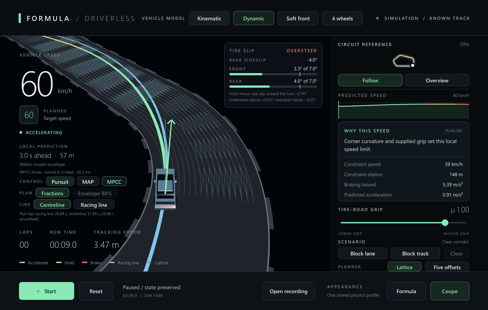

*Actual application capture at the 1100×700 minimum, 9 s into a run of the dynamic car driven by MPCC: the green ribbon
is MPCC's plan, cutting the inside of the first corner beside the blue racing line, with the car 3.5 m inside the
centreline at 60 km/h and 4.0° of rear sideslip against a 7.0° peak. The caption under the prediction gives who drives,
the solver's status and this decision's solve time. WHY THIS SPEED still explains the reference plan, 39 km/h here,
which MPCC does not drive to.*

### What each tire has left along that plan

The prediction model MPCC plans with knows axle loads on one track, so it cannot say what a wheel has left. The
four-wheel plant can: driven along the plan by the plan's own commands, it says at every point what each wheel is using
of its own friction circle ([tire margin decision](docs/decisions/0027-tire-margin-along-the-horizon.md)). The tire slip
card draws it under the four wheels, live or in replay, whenever a plan that states its commands drives that car.

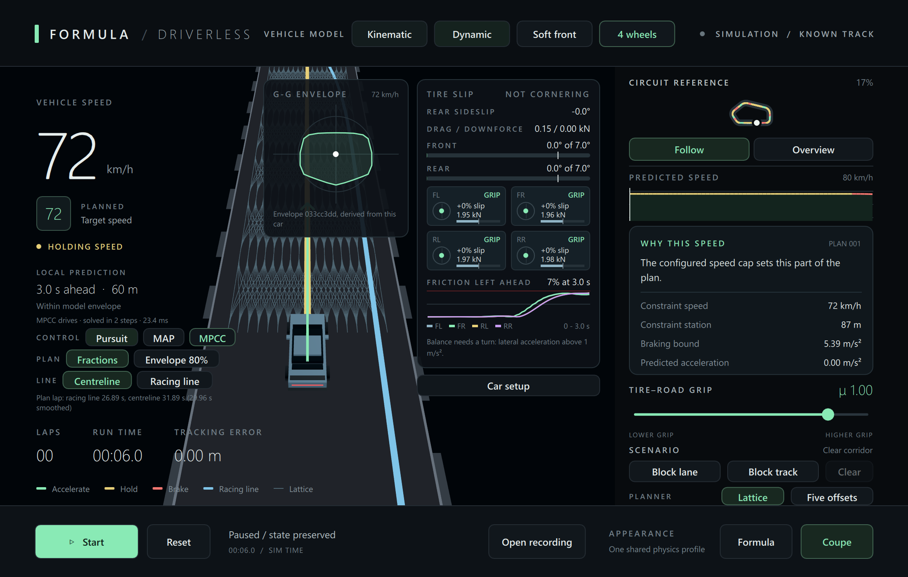

*Actual application capture at the 1100×700 minimum, 6 s into a run of the four-wheel car driven by MPCC: under the four
wheel tiles, FRICTION LEFT AHEAD gives the busiest moment of the plan, 7% left three seconds out, and the plot traces
each wheel's use of its circle across those three seconds, with the tires' own limit as the red line at the top. The
front pair and the rear pair separate as the plan's braking moves the car's load forward.*

## Measure the prediction model

A plan that drives records the acceleration and steering it commands at each of its points, and from that the recorded
plant can be driven by the plan's own commands, from the state the plan was made in, with nothing replanned
([model mismatch decision](docs/decisions/0025-measured-model-mismatch.md)). How far each plan was from that plant
response is its **model error**, the prediction model's own; how far it was from where the car went is its **plan
error**, which adds the replanning, since the car follows each plan for one control period only.

```powershell
build/core/apps/headless/Release/fd_headless.exe --plant four-wheel --controller mpcc --laps 2 --out out/runs/my-mismatch
build/core/apps/headless/Release/fd_headless.exe --prediction-error out/runs/my-mismatch
```

It prints both every 0.25 s to the three-second horizon, with the model error's component along the plan and across
it and its speed difference, then the flying laps alone and the eight plans the model got most wrong a second ahead.
From the final runs, median and 95th percentile:

| MPCC run | Model error 1 s ahead | 3 s ahead | Plan error 1 s ahead | 3 s ahead |
| --- | ---: | ---: | ---: | ---: |
| Dynamic car, whose model is its plant | 0.004 / 0.036 m | 0.07 / 0.19 m | 0.008 / 0.29 m | 0.45 / 3.63 m |
| Four-wheel car | 0.021 / 0.076 m | 0.10 / 0.46 m | 0.026 / 0.28 m | 0.48 / 3.21 m |

For the dynamic car the model error is only the plant's hold of each command over a control period and its shorter
integration step. Before this decision the four-wheel car's was 0.091 / 0.26 m a second ahead and 1.26 / 4.86 m three
seconds ahead: switching its effects off one at a time showed drag leaving the plant 0.78 m behind each plan and load
transfer causing the tail, and with both off it was the dynamic car's. Three seconds ahead the plan error stays near
half a metre for both, because there it is mostly replanning.

## Head to head on one car

The plan's baseline for MPCC is MAP with the car's own envelope speed plan, on the same car and the same scenarios
([head-to-head decision](docs/decisions/0026-head-to-head.md)). Only the four-wheel car has an envelope, and only it has
wheels that can lock, so the comparison runs on that car; MAP now steers it from a table of its own steady turns, with
its wheel speeds and loads solved along with them.

```powershell
build/core/apps/headless/Release/fd_headless.exe --plant four-wheel --steering map --speed-plan envelope --laps 2 --out out/runs/my-map
build/core/apps/headless/Release/fd_headless.exe --plant four-wheel --controller mpcc --laps 2 --out out/runs/my-mpcc
```

| Scenario and driver (`out/runs/p63-*`) | Laps | Tracking error, max / RMS | Peak friction use of any wheel | Wheel-locked samples | Invalid samples |
| --- | ---: | ---: | ---: | ---: | ---: |
| Two clear laps, Pure Pursuit | 34.05 / 32.34 s | 0.34 / 0.16 m | 0.826 | 0 | 0 of 13279 |
| Two clear laps, MAP with 80% of the envelope | 31.95 / 30.70 s | 0.41 / 0.19 m | 0.978 | 0 | 0 of 12530 |
| Two clear laps, MPCC | 26.97 / 25.33 s | 3.67 / 1.50 m | 0.958 | 0 | 0 of 10461 |
| Lane blocked, Pure Pursuit | 34.01 s | 3.23 / 0.64 m | 0.831 | 0 | 0 of 6803 |
| Lane blocked, MAP with the envelope | 31.94 s | 2.80 / 0.59 m | 0.977 | 0 | 0 of 6389 |
| Lane blocked, MPCC | 27.01 s | 3.68 / 1.60 m | 0.957 | 0 | 0 of 5403 |
| Bollard entering the first corner, Pure Pursuit | 33.87 s | 3.25 / 1.05 m | 0.975 | 0 | 0 of 6774 |
| Bollard entering the first corner, MAP with the envelope | 31.66 s | 3.66 / 1.19 m | 0.997 | 0 | 0 of 6334 |
| Bollard entering the first corner, MPCC | 47.35 s | 44.44 / 14.99 m | 1.000 | 165 | 3615 of 9471 |
| Grip 0.7 from 10 s, Pure Pursuit | 38.12 / 37.39 s | 0.40 / 0.15 m | 0.965 | 0 | 89 of 15103 |
| Grip 0.7 from 10 s, MAP with the envelope | 35.11 / 34.69 s | 0.52 / 0.20 m | 1.000 | 0 | 131 of 13960 |
| Grip 0.7 from 10 s, MPCC | 28.59 / 27.40 s | 3.87 / 1.76 m | 0.958 | 0 | 0 of 11200 |

MPCC is 5.0 s a lap faster than the baseline on clear laps and 6.5 s faster after the grip drop, and it is the only
driver of the three with no invalid sample there. Its tracking error is large because it is not following the reference
line: it uses the corridor. The baseline works its tires hardest (0.978 of a wheel's friction circle on clear laps
against MPCC's 0.958), since the envelope plan drives the whole car to its limit. Solving took 18.5 ms at the median on
the clear laps, against the 20 ms control period.

At the bollard entering the first corner MPCC loses the car. It arrives at 19.5 m/s, where the baselines arrive at 16.5
and 15.5 m/s and pass without ever stopping. At that speed the planner, which compares actions by rolling the policy
forward within the reference plan's grip, finds no clear path past the bollard and holds; the hold is the policy's to
brake, 15 m short at 19.5 m/s. The car slides, locks a rear wheel, leaves the track, and rejoins 13 s later. The same
scenario is survived by the dynamic car, whose wheels cannot lock. That is a gap between the planner's yardstick and
what MPCC actually drives, not a fault of the optimiser, and it is the clearest thing this comparison found.

## Read the car through its own instruments

The car can be given the instruments it would actually have
([instruments decision](docs/decisions/0029-the-car-reads-itself-through-instruments.md)): pose and speed at 20 Hz
arriving 50 ms after they were sampled, wheel speeds, an inertial unit and steering at 200 Hz arriving 5 ms after, each
value carrying its own Gaussian error. Every error of a run is drawn from one seed, which the recording keeps, so the
run measures the same again.

```powershell
.\build\core\apps\headless\Release\fd_headless.exe --plant dynamic --laps 1 --sensors 7 --out out\runs\my-measured
.\build\core\apps\headless\Release\fd_headless.exe --check-recording out\runs\my-measured
```

```
Contract: schema 14 valid; 6760 samples over 33.795 s; 1 plan revisions; 0 parameter events; laps 1; invalid samples 0
Sensors: seed 7, fingerprint cc1b3da2e54414f8; pose and speed at 20.000 Hz behind 50.000 ms, wheels, inertial unit and
steering at 200.000 Hz behind 5.000 ms; 6760 ticks measured, the pose delivered on 6740 of them, up to 95.000 ms old
(72.500 ms on average), out by up to 1.974 m, speed by up to 0.609 m/s, yaw rate by up to 0.007 rad/s; the car drove on
its true state
```

**What they measure drives nothing yet.** The plant still advances on its own state and every decision is still made
from it; the run records what was measured beside what was true, in `measurements.csv`, one row per tick. Moving the
controller onto the measurements is Phase 7.4 of the plan, where it can be tested as the change it is. Until then the
point is the size of the gap: nearly two metres and about 95 ms at racing speed, almost all of it age rather than
noise, because a 20 Hz channel behind a 50 ms dead time is between one and two periods old whenever it is read.

Loading the recording runs the same instruments again, from the recorded seed over the recorded states, and requires
the same stream. A measurement nudged by a millimetre is refused by name, and so is a seed changed without its
fingerprint. Nothing here detects, classifies or tracks anything: these are the car's own instruments reading its own
state, not perception.

The desktop offers them under **Sensors** in its Settings while paused, and the SENSORS card of its telemetry draws what
the car measures: the pose's age, how far out it is, the speed read with its error, and the yaw rate's error.

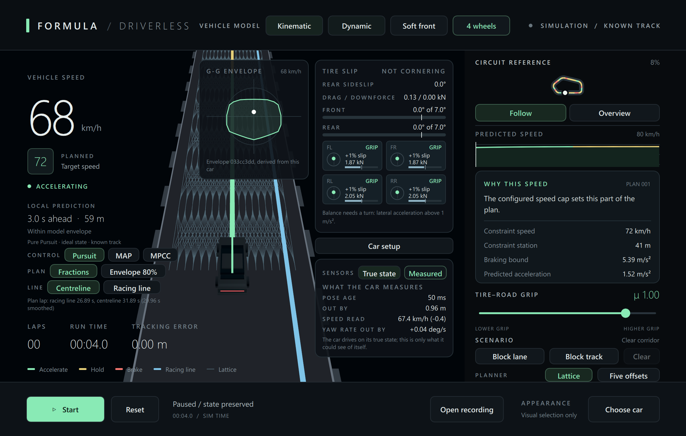

*Actual application capture at the 1100×700 minimum, 4 s into a run of the four-wheel car with its instruments fitted:
the pose read is 50 ms old and 0.96 m out at 68 km/h, while the car itself drives on its true state.*

## Perceive the course's cones

The course's cones can be laid along the corridor, blue on the left and yellow on the right, and the car given simulated
cone perception of them ([perception decision](docs/decisions/0030-simulated-cone-perception.md)), after PacSim's
model: a front sensor at 10 Hz whose frames arrive 200 ms late, seeing 1 to 45 m and 60° either side, missing cones and
mistaking their colour more often the farther they are, never naming a colour beyond 15 m, and reporting each position
with the covariance of its noise.

```powershell
.\build\core\apps\headless\Release\fd_headless.exe --plant dynamic --laps 1 --perception 4 --out out\runs\my-perceived
.\build\core\apps\headless\Release\fd_headless.exe --check-recording out\runs\my-perceived
```

```
Contract: schema 17 valid; 6760 samples over 33.795 s; 1 plan revisions; 0 parameter events; laps 1; invalid samples 0
Perception: seed 4, fingerprint 486cce1e685df7cf; 240 cones; 1 sensor(s), the first at 10.000 Hz behind 200.000 ms seeing
1.000 to 45.000 m; 335 frames, 4681 simulated detections (13.973 a frame, the farthest 46.000 m), 2195 cones in view
missed, 128 of 1618 coloured detections the wrong colour, 3063 uncoloured; nothing drove on them
```

These are simulated detections of known cones. On the known track nothing drives on them; the next section does.
A frame never says which cone a detection was; the recording keeps that, and which cones were missed, apart for
evaluation, and loading it perceives the lap again from the seed and requires the same frames.

In the desktop, **Cone perception** in the Settings draws the course's cones and the newest frame's detections where the sensor put
them, placed from where the car truly was: diamonds in the colour reported, grey rings on cones it missed, red crosses
on wrong colours, and each detection's ellipse.

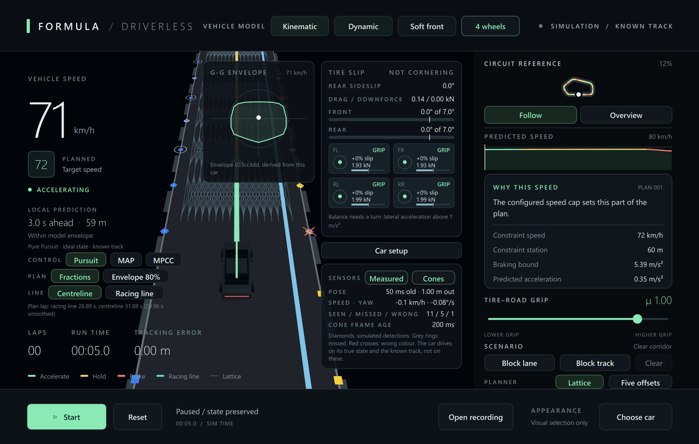

*Actual application capture at the 1100×700 minimum, 5 s into a four-wheel run with instruments and cones fitted: blue
cones left and yellow right, the newest frame's diamonds on the cones it saw, grey rings on those it missed and a red
cross on one it saw the wrong colour.*

## Drive on the cones

With `--drive cones` the car follows the path it believes from its own simulated detections instead of the known track
([cone driving decision](docs/decisions/0031-driving-on-cones.md)). At every frame a port of FaSTTUBe's cone path
planner sorts the cones it remembers into boundaries, matches them across the track and fits a path through the middle;
the policy follows that path, planning to be able to stop where it ends, since nothing is known beyond. With
`--sensors` the driver reads the car's instruments; without them it reads the true state, and says so. The preset needs
`--track-width 5`, the width FaSTTUBe's planner is tuned for; the known track then only judges the run.

```powershell
.\build\core\apps\headless\Release\fd_headless.exe --track-width 5 --perception 3 --sensors 3 --drive cones --out out\runs\my-cones
.\build\core\apps\headless\Release\fd_headless.exe --check-recording out\runs\my-cones
```

```
Contract: schema 17 valid; 9862 samples over 49.305 s; 1 plan revisions; 0 parameter events; laps 1; invalid samples 549
Cones: driven on the believed path from the measured state; 483 paths believed, the first followed at 0.300 s, 15
decisions braking with none; over their first 15 m they lay a median 0.344 m and at worst 4.031 m from the true
centreline; a driver run again on the recorded readings and frames alone believed and commanded the same at every
decision
```

The last clause is the proof that nothing but observations reached the driver: loading the recording runs a second
driver on the recorded readings and frames alone and requires every belief, path and command. On the known track the
same car laps in 33.5 s; on cones, riding the limit of what it can see, in 49.3 s. In the desktop the Settings'
**Drive on** row offers Track or Cones once the car perceives; Cones lays the preset to 5 m and draws, in violet, the path
the car believes, the corridor it believes and where it believes it is.

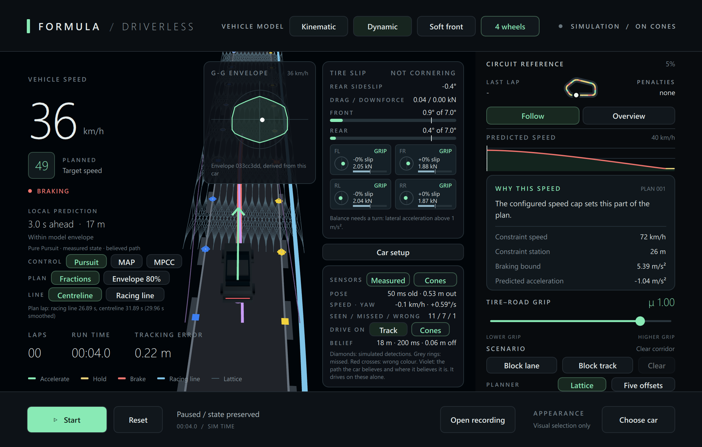

*Actual application capture at the 1100×700 minimum, 4 s into a four-wheel run on cones from the measured state.*

## Judge a run, and drive Formula Student layouts

Every run is judged as a Formula Student official would, after PacSim's competition logic
([judging decision](docs/decisions/0032-judging-and-formula-student-courses.md)): the start line starts the clock, laps and
sectors are timed from it, a cone down or out costs 2 s, all four wheels off the course 10 s, eight seconds of it is a
DNF, and after the finish the car must stop within 30 m. `--discipline autocross` judges one lap instead of a
trackdrive's ten. The judge reads the true pose and nothing that drives reads the judge; every recording is judged again
when it loads. `--course FILE` drives one of PacSim's Formula Student layouts, read from where it lies and never copied
here, whose hairpins need a Formula Student car's wheelbase and lock:

```powershell
.\build\core\apps\headless\Release\fd_headless.exe --config configs\formula-student.cfg --course <PacSim>\tracks\FSG23.yaml --discipline autocross --laps 1 --perception 5 --drive cones --out out\runs\my-fsg23
```

```
Course: FSG23 from a PacSim layout: 99 blue, 95 yellow and 0 orange cones, 1 timekeeping gate(s); traced into 316.427 m,
3.018 to 4.287 m wide, its tightest radius 2.841 m
Competition: autocross on the course PacSim layout FSG23 (194 cones); 1 of 1 laps timed (34.955 s, best 34.955 s); 1
cone(s) down or out, 0 time(s) off course (0.000 s), 2.000 s of penalties; finished in 34.955 s, 36.955 s with penalties,
its stop not judged: the run ended at the line
```

Of PacSim's thirteen Formula Student layouts as autocrosses, all finish on the known track, ten of them clean; on cones
all finish too, eight clean from the true state and four from the car's instruments. The desktop states the last lap
and the penalties beside the circuit map, draws each knocked cone as a red cross, and opens a layout with
`./scripts/run.ps1 --course FILE`.

## Choose a physics profile

`--profile ID` builds the four-wheel car from a documented source
([profiles decision](docs/decisions/0033-physics-profiles.md)): `formula-one-style` from Limebeer et al. 2014 through
fastest-lap, `formula-student-electric` from PacSim and MPCC, `electric-race-car` from TUM's example, `racing-kart` from
Lot 2016, or the project's own `project-roadster`. Every value is marked published, derived, fitted or chosen in
`core/vehicle_profiles.cpp`, and the recording names the profile, checked on loading to be exactly that profile's car.
A lap of the preset on each profile's own envelope plan takes 22.34 s for the Formula One car, 22.67 s for the Formula
Student car, 31.39 s for the kart and 31.95 s for the roadster; TUM's car, whose tire the minimum-time cross-check
corrected, is in the next section. The profiles are physics only; the showroom's appearances are not tied to them, and
the desktop takes one at start with `--profile ID`.

## The theoretical best lap

How fast could this car drive this corridor, and how far is the controller from it? `--write-lap-problem DIR` writes the
four-wheel car of `--profile` (or `--plant four-wheel` and its setup flags) and the corridor, and
`tools/optimal_lap/solve_fastest_lap.py` gives both to fastest-lap 0.5, a minimum-time optimal control solver run
offline beside the build ([decision](docs/decisions/0034-theoretical-best-lap.md), commands and downloads in
[its README](tools/optimal_lap/README.md)). The artefact states the solver, its version and digests, Ipopt's own exit
status, the mesh, the tolerance and how the car was put into fastest-lap's model; `--check-optimal-lap DIR` reads it as
one contract and requires it to be the optimum of the problem the same flags pose in this build. The desktop, started
with `--profile ID --optimal-lap DIR`, draws the optimum's car translucent beside the live one, labelled offline optimum,
with the live lap against it sector by sector, each tire's dissipated energy on the optimum's lap, and what a setup step
would be worth; it hides all of it, saying why, when the car or corridor on screen is not the one solved.

For the Formula One style car on the preset the optimum is 14.143 s ("Optimal Solution Found", 500 mesh points,
tolerance 1e-8), where the controller's best flying lap is 19.160 s on the full envelope plan and 15.115 s under MPCC.
TUM's independent formulation laps the same car within 1.0% of fastest-lap once both solve the same friction.

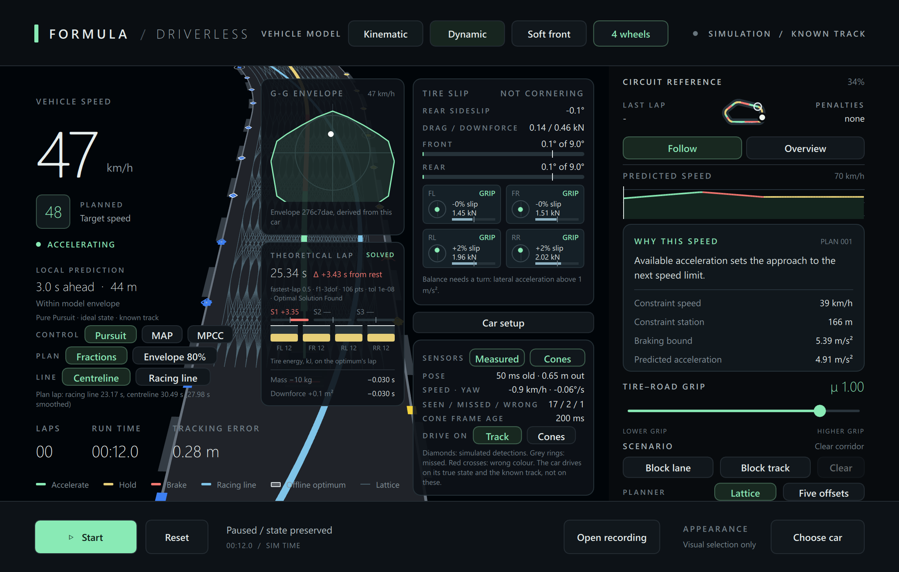

*The desktop's UI verification with a steady fixture lap (20 m/s, 1 kW per tire) loaded as the Formula One style car's
optimum, 12 s into the live lap: its lap, the solver and Ipopt's status, the live lap 3.43 s behind it from rest, the first
sector timed, each tire's energy so far against its whole lap, two setup sensitivities, and the optimum's ring on the
circuit map. The optimum's car itself is out of frame ahead.*

## Validate a recording

The run directory is one contract, and the reader checks its files against each other:

```powershell
.\build\core\apps\headless\Release\fd_headless.exe --check-recording out\runs\replay-demo
```

It reports the sample count, plan revisions, parameter events, laps, the recorded decisions,
the vehicle and the steering law, re-runs this build's planner over the recorded track for every revision's
configuration, and re-integrates every recorded step with this build's plant:

```
Contract: schema 1 valid; 16254 samples over 81.265 s; 2 plan revisions; 1 parameter events; laps 2; invalid samples 154
Scenario: 0 stated blocked region(s)
Decisions: not recorded (schema 1)
Vehicle: kinematic bicycle, rear axle reference (plant state not recorded, schema 1)
Steering: Pure Pursuit (not recorded before schema 4; those runs used it)
Source: b698fb7f8a30805b0f3652d90d9ad46bdb967a020f7967f71dbfecaac700d10f (different build)
Planner reproduction: max speed difference 4.191e-10 m/s
Plant reproduction: not available (schema 1 recorded no steering command)
```

That last number is the largest disagreement between the recorded plan speeds and the ones
this source reproduces. Near zero demonstrates matching speeds for those inputs; the source
fingerprint separately identifies the producing build. A recording
made by different source still loads and replays, and says so. Anything that breaks the
contract is rejected by name, for example `telemetry.csv line 803 revision disagrees with
events.csv timing`, rather than replayed as if it were valid. Recorded decisions are checked
the same way: their times must be exactly the control ticks plus replans, each predicted line
must start at the recorded state, and each recorded command must equal the first command of the
decision that governed it ([recording decision](docs/decisions/0007-recorded-decisions.md)).
Plant reproduction reports the largest one-step position difference: about 1e-9 m for a run from
this build's plant, and far more for an edited vehicle parameter
([schema 3 decision](docs/decisions/0009-usable-dynamic-plant.md)). A MAP run also reports its
table's fingerprint and whether this build derives the same table from the recorded car. A
four-wheel run also counts the samples with a wheel locked while moving and, from schema 6, the samples
with a wheel lifted and the largest front axle load above its load at rest.
A clear lap with decisions is about 19 MB.

## Verification and portability

Windows x64: MSVC 19.44.35217, Windows SDK 10.0.26100.0, CMake 3.31.6, Qt 6.8.3.
The desktop build runs twenty-one CTest suites: the racing line, MPCC, numerical/behavioral checks, the vehicle models, the
four-wheel car, its load transfer, its aerodynamics, the effect of each setup control, the performance envelope, the
envelope speed plan, track conditioning, the offline lattice, speed profiles, the lattice planner, the steering law, the tire force model, rolling
prediction, local action selection, recording round-trip and playback, the end-to-end recording contract, and actual QML controls/bindings; the
core build runs all but the last, and without OSQP's sources also skips the racing line and MPCC. The last also captures 1100×700 views and
rejects QML runtime warnings. See [status and evidence](docs/STATUS.md) for the measured
run, including the planning cost against the control period.

The headless build has no Qt dependency. A fresh configure of the same sources built and
passed its earlier three suites, and the resulting executable linked only the MSVC runtime and
Windows system libraries:

```powershell
dumpbin /dependents .\build\core\apps\headless\Release\fd_headless.exe
```

Linux headless commands are provided in CI, but have not been executed on this Windows host:

```sh
cmake --preset linux-core
cmake --build --preset linux-core
ctest --preset linux-core --output-on-failure --no-tests=error
```

No ROS, WSL, Gazebo, Rerun or hardware integration has been verified. No GPU model or frame-rate
claim is made from the successful render. Qt captures can be reproduced without editing footage:

```powershell
.\scripts\run.ps1 --at-time 8 --capture out\preview\braking.png
.\scripts\run.ps1 --replay out\runs\replay-demo --at-time 20 --capture out\preview\replay.png
.\scripts\run.ps1 --obstruct 62:68:-4.5:1.0:cone-cluster --at-time 4.4 --capture out\preview\avoidance.png
.\scripts\run.ps1 --obstruct 62:68:-4.5:4.5:stalled-car --at-time 5.5 --capture out\preview\blocked.png
.\scripts\run.ps1 --verify-ui out\preview\controls
```

`--capture` grabs the window at whatever size it opens at, which on a short screen is below the 1100×700 the
layout is designed for. `--verify-ui` drives the same controls, resizes to exactly 1100×700 and writes its
`compact-*.png` captures beside its `verification.json`; the captures above that show the compact window come from
there.

## Continue the project

[Project brief](docs/PROJECT_BRIEF.md) preserves the product scope;
[full supplied master prompt](docs/reference/MASTER_PROJECT_PROMPT.txt) preserves the longer vision.
[Research corrections](docs/RESEARCH_NOTES.md), [paper evidence](docs/SIMULATION_EVIDENCE.md),
[visual references](docs/VISUAL_REFERENCES.md) and [the twelve workflow skills](docs/SKILLS.md)
record what was actually inspected. Codex and Claude Code share [AGENTS.md](AGENTS.md).
[CONTEXT.md](CONTEXT.md) is the glossary of the project's domain terms.
[TrackWayFastPlan](docs/TrackWayFastPlan.md) audits seven open-source racing projects and maps
their tire, vehicle, racing-line, planning and control algorithms onto a phased plan for this
codebase; it is a roadmap, not implemented behaviour.

Done from that plan: exact nearest-point projection about seven times faster with
byte-identical recordings, recordings that keep every decision so replay shows it, a tested
tire force model ([tire decision](docs/decisions/0006-tire-force-model.md)), and a dynamic
single-track plant behind a vehicle seam that the unchanged controller laps and that reproduces
rear-wheel-drive power-on oversteer ([plant decision](docs/decisions/0008-dynamic-single-track-plant.md)),
now fast enough to plan with, recorded and selectable
([usability decision](docs/decisions/0009-usable-dynamic-plant.md)), and MAP steering from that
plant's steady-state table ([steering decision](docs/decisions/0010-map-steering.md)), Phase 1's
tire slip and balance visuals ([balance decision](docs/decisions/0011-tire-slip-and-balance.md)), and
a car with four rotating wheels that locks and spins, recorded and selectable
([wheel decision](docs/decisions/0012-four-rotating-wheels.md),
[recording decision](docs/decisions/0013-recording-and-showing-wheels.md)), and quasi-static load
transfer on that car with wheel loads and friction circles in the desktop
([load transfer decision](docs/decisions/0014-quasi-static-load-transfer.md)), and aerodynamics with a
viscous coupling ([aerodynamics decision](docs/decisions/0015-aerodynamics-and-viscous-coupling.md)).
Phase 2.4's honest setup controls ([setup decision](docs/decisions/0016-honest-setup-controls.md)) complete
the plan's Phase 2, and Phase 3.1 derives the car's own G-G-V envelope from the plant
([envelope decision](docs/decisions/0017-performance-envelope.md)), and Phase 3.2 plans speed from a share of it
([envelope plan decision](docs/decisions/0018-envelope-speed-plan.md)), and Phase 3.3 conditions a traced centreline
into a track ([conditioning decision](docs/decisions/0019-track-conditioning.md)), and Phase 3.4 solves a
minimum-curvature racing line drawn beside the centreline with an estimated lap for each
([racing line decision](docs/decisions/0020-minimum-curvature-racing-line.md)), which completes Phase 3; Phase 5.1 lays
the offline lattice ([lattice decision](docs/decisions/0021-offline-lattice.md)), and Phase 5.2 searches it for an action
set, passing, returning and braking toward the gap
([lattice planner decision](docs/decisions/0022-lattice-planner.md)), and Phase 5.3 gives every compared action its own
speed profile so the car takes the fastest clear one and drives it
([speed profile decision](docs/decisions/0023-per-action-speed-profiles.md)), which completes Phase 5; and Phase 6.1 ports
MPCC to drive the chosen action for the cars with tires, recorded with who drove each decision
([MPCC decision](docs/decisions/0024-model-predictive-contouring-control.md)); Phase 6.2 measures its prediction model
apart from its replanning and predicts the four-wheel car with its pitch and air
([model mismatch decision](docs/decisions/0025-measured-model-mismatch.md)). Next: the rest of Phase 6, the
head-to-head and the per-wheel friction margin, or Phase 4's theoretical best lap once its download is approved. See the
[prediction decision](docs/decisions/0003-rolling-policy-prediction.md) and the
[selection decision](docs/decisions/0004-local-action-selection.md). ROS recording and the
short driving demonstration remain on the roadmap. The local Blender showroom is implemented (see [its contract](docs/SHOWROOM.md)).
No team outreach, remote repository or public release was created.
