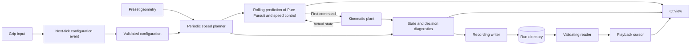

# Architecture and contracts

The first internal slice has one C++20 simulation owner and a Qt presentation adapter.
Algorithms have no Qt or ROS imports. By default this is known-map software-in-the-loop with ideal
state access; driving on cones (decision 0031) the car decides from its simulated readings and detections alone. It is
not real perception, hardware emulation or a validated digital twin.

## Modules

`core/` defines geometry, configuration, periodic speed planning, the pure `compute_control`
function and the bicycle equation. Future adapters can call the same planner/controller source.
`make_local_trajectory` predicts the feedback policy from copied actual state over three
seconds; Simulation consumes its first command. Prediction is separate from the global
reference speed plan, and is not a trajectory optimizer.
`adapters/simulation/` owns the clock, controller scheduling, plant state, applied commands,
configuration events and diagnostics. `core/local_planner.*` chooses this control interval's action and returns the
choice together with everything it rejected, each option predicted with the same rollout and rejected when it leaves the
model envelope or enters a stated blocked region. `choose_lattice_action`, the default (decision 0022), follows the
reference line while it stays clear; when it enters a blockage it searches the offline lattice for the cheapest path
passing the blockage on its left and on its right, and otherwise brakes toward the widest gap beside it. A lattice path
is straight segments between nodes that `compute_control` pursues through `ControlIntent::path`; the search keeps clear
of blockages, inside the corridor and within the lateral budget at a speed the car can brake to, keeps the stretch of
the previous path within a pursuit distance, and returns along the lattice after a pass. Each path compared gets a speed
profile from `core/speed_profile.*` (decision 0023): curvature limits from the path as pursued, a backward pass from the
reference plan's speed at a horizon common to the decision and a forward pass from the car's actual speed, within the
plan's own limits. The option is predicted following that profile through `ControlIntent::speed_profile`, and the clear
option of least estimated time is taken, so passes and returns are compared by time; where none is clear the car brakes
for the blockage it named, or, with the blockage behind it, keeps the path it is on. `choose_local_action`, the five lateral
offsets of decision 0004, remains selectable for comparison as `LocalPlannerMode::five_offsets`. The simulation lays the
lattice along its track when blockages are stated. An `Obstruction` is scenario ground truth, not perception.
`core/predictive_control.hpp` is the seam for a controller that plans the car's motion over the horizon instead of the
policy (decision 0024): `PredictiveController::plan` takes the plant state and the planner's decision and returns a plan
on the prediction's grid whose first command drives. The simulation, given one, asks it at every decision and holds its
first command only when its plan is solved, inside its own envelope and the corridor, clear of every blockage by
`first_blockage_entered`, and the decision does not hold; otherwise the policy drives, and `controller_outcome()` says
who drove and why. A plan states its planned command at each point, and the simulation refuses, as a broken controller,
one that does not or whose first command is not where those commands are at the end of the control interval
(`planned_command`, decision 0025). `plant_response` drives a copy of the plant by a plan's commands exactly as the
simulation holds a command, the measure of a prediction model apart from replanning; `plan_tire_use` asks the seam, at
each point of that response, what each wheel of a four-wheel car is using of its own friction circle, which the desktop
draws along the horizon (decision 0027). `SingleTrackModel` in
`core/vehicle.*` prepares the dynamic plant's own equations for a controller to predict with, and `reduced_single_track`
gives any car with tires a single-track model, the four-wheel car's with its pitch and air (decision 0025); a
controller's `check` refuses a car it cannot drive when the simulation is built.
`adapters/sensors/` owns the instruments the car reads itself with (decision 0029): a rate, a dead-time queue and a
seeded Gaussian error per channel for pose, speed, wheel speeds, the inertial unit and steering, after PacSim's own
structure. `SensorSuite::observe` takes the plant's true state and delivers each channel's newest sample whose dead time
has passed. It depends on `fd_core` alone and detects, classifies and tracks nothing: these are the car's own
instruments, not perception. The simulation observes them at every fixed tick and exposes what they delivered; on the
known track it never reads them itself, and the plant always advances on its true state.
`core/cones.*` lays the course's cones along the corridor's boundaries (decision 0030), ground truth like a stated
blockage. `adapters/sensors/perception.*` observes them from the car's true pose with PacSim's perception model in the
plane: range and field of view, detection and colour probabilities falling with distance, polar noise with its
propagated covariance, a dead time per sensor, a stream per sensor from a recorded seed. It delivers `PerceptionFrame`s,
which hold only detections in the car's frame, and keeps `PerceptionTruth`, which cone each was and which were missed,
apart for evaluation. The simulation observes it every tick; on the known track it never reads it.
`core/cone_path.*` ports FaSTTUBe's cone path planner (MIT), sorting, matching with virtual cones and a spline path, with
`core/fitpack.*`, a port of the FITPACK routines its spline fit calls (decision 0031); both reproduce the published
package and SciPy on fixtures kept in `tests/fixtures`. `core/delaunay_path.*` is a second, independent method written
from FS-FEUP's description, there to cross-check the port. `core/path_following.*` drives an open path: speeds by the
reference plan's rules to rest at its end, the policy along it, and its prediction. `adapters/simulation/cone_driving.*`
holds the `ConeDriver`, which in the unknown-track mode is the whole of what decides: it is given the start pose, pose and
motion readings (the instruments' or, without them, the true state as the stated ideal-state assumption) and perception
frames, places each frame's detections on the map by the pose it believed at the frame's sampling, plans the believed
path and follows it. It is never given the track, the cones or a frame's truth; the simulation, whose track then only
judges the run, feeds it through `feed_driver` alone. The driver remembers the cones it placed within 30 m (decision
0032).
`core/competition.*` judges a run after PacSim's competition logic (decision 0032): a `Judge` observes the true pose every
tick on a `Course`, the track's corridor, its cones and its timekeeping gates, and lists laps, sectors, cones down, off
course, an unsafe stop and a DNF by a discipline's rules. The simulation observes it; nothing that drives reads it.
`load_pacsim_course` reads a Formula Student layout in PacSim's format and `course_from_layout` traces it into a course.
`core/vehicle_profiles.*` holds the physics profiles (decision 0033): four-wheel cars from named sources, each value's
provenance stated; the headless runner builds a car from one and the recording names it.
`adapters/recording/` owns schema 17 as one contract:
`RecordingWriter` produces a run directory, `load_recording` reads and cross-checks it, and
`Playback` moves a cursor over the loaded samples. It uses only the standard library. Its prediction error functions
measure a predictive controller's recorded plans against where the car went (plan error) and against the plant's
response to each plan from the recorded state (model error); the second drives this build's plant, as the plant
reproduction check does, and is a measurement, not a replay. Loading a measured run runs its instruments again from the
recorded seed over the recorded states and requires the same stream, so a recording carries both what was measured and
the means of measuring it again; loading a perceived run does the same for every perception frame from the recorded
cones; and loading a run on cones runs a driver again on the recorded readings and frames alone and requires every
belief, believed path and command recorded, so each such recording proves its decisions came from observations; and
loading any run judges its recorded samples again on its recorded course and requires the same events.
`core/tire.*` computes steady-state tire force from slip ratio, slip angle and vertical load,
with load-sensitive peak friction and combined slip (decision 0006); `PreparedTire` validates a tire once
for evaluation at whatever load it carries. `core/vehicle.*` is the
vehicle seam (decisions 0005 and 0008): a closed variant of the kinematic bicycle, a dynamic
single-track model, with longitudinal load transfer and aerodynamics off unless set (decision 0025), and a car with four
rotating wheels (decision 0012) whose load moves between its
wheels quasi-statically (decision 0014) and which feels drag, downforce and a viscous coupling (decision 0015),
copyable `PlantState` with wheel speeds and wheel loads, and pure `advance`, `demand` and `envelope` functions that the simulation, the prediction
and the planner all use. The prediction asks `envelope`, which gives exactly `demand`'s envelope answer
without evaluating tire forces. `demand` also reports axle slip angles, their peaks and each wheel's
slip and friction use, `aerodynamic_force` gives drag and downforce, `quasi_static_wheel_loads` solves weight
plus downforce, pitch, roll and the roll-balance closure for the four loads, and `handling_balance` reads understeer, oversteer or neutral from front against rear slip
(decision 0011). All three models are selectable in the headless runner and the desktop and recorded
(decisions 0009 and 0013). `core/setup.*` lists the four-wheel car's setup controls, their offered ranges and
tested effects, and applies one as a validated new car (decision 0016). `core/performance_envelope.*` derives the
four-wheel car's G-G-V envelope through the same seam (decision 0017): at each speed of a grid it holds the plant at
speed while sweeping steering until a turn cannot settle with every tire within its peak, then probes the largest
forward and braking commands from settled turns at fixed fractions of that lateral limit, left and right separately.
It is fingerprinted with the steering table's shared model identity (`core/src/model_identity.*`), queried by
interpolation, and exported in TUM's `ggv.csv` format; its speeds and sides are derived in parallel, about a quarter
second per car. The desktop draws it as a live G-G diagram. Under `SpeedPlanMode::performance_envelope` the simulation
derives it, plans from a share of it and bounds every control decision by it (decision 0018). `core/track_conditioning.*` turns a closed centreline, traced or drawn, into a `Track` (decision
0019): linear resampling, a periodic cubic P-spline fitted within a root-mean-square allowance, uniform arc-length
resampling with analytic curvature and left normals, and refusal of a line that crosses itself, normals that cross
within half the width, and a corridor that overlaps itself; `condition_track(track)` does the same for points taken
along a track, such as the preset. A `Track` may carry per-sample `left_edge_m` and `right_edge_m`, its distance to the
corridor's edges when the reference is not the corridor's centre; `corridor_at` and `within_corridor` answer for any
track, and for a centreline give exactly the half-width rule, so the simulation, prediction and planner check a racing
line's corridor the same way. `estimated_lap_time` gives the lap a plan implies on its track.
`raceline/` is `fd_raceline`, outside `fd_core` and built only when OSQP's sources are in `.tools/osqp` (decision 0020):
`make_minimum_curvature_line` shifts a conditioned centreline's samples along their left normals to minimise squared
curvature, linearised in the shifts, as a sparse QP solved with statically linked OSQP inside the corridor less the
vehicle's half width and a margin and within the steering limit, re-linearising until no sample moves more than 0.02 m.
Its result is an ordinary `Track` with corridor edges, which the controller, prediction, planner and recordings use
unchanged. `mpcc/` is `fd_mpcc`, built with the same OSQP (decision 0024): `Mpcc` implements the predictive controller
seam as model predictive contouring control, sixty stages of 0.05 s of the single-track model, contouring and lag error
against the chosen action's path, progress rewarded, the corridor that action leaves open, and each axle's slip angle and
friction ellipse as softened constraints, solved by two sequential quadratic programming steps per decision from its last
plan or the policy's prediction. `core/lattice.*` lays the offline lattice along any reference (decision 0021), after Stahl et al. 2019:
layers every 6 m, 4 m where it curves; nodes every 0.5 m across the corridor less the vehicle half width; an edge from
each node to each node of the next layer within 0.3 m of offset per metre, an offset quintic in station with zero second
derivative at both ends and each node's slope, which follows the corridor where the reference crosses it; edges the car
cannot steer or that leave the corridor removed, then dead ends; and an offline cost of curvature and deviation on each.
`make_lattice` returns plain data and runs no search; the lattice planner searches it. `core/steering.*` generates a
plant's steady-state steering table through
that seam: for each speed and steering angle it solves for the turn one control period of
`advance` returns unchanged, keeping only stable turns inside the tire envelope. The unknowns are
the car's lateral velocity, yaw rate and the command holding its speed; a car with rotating wheels
adds its four wheel speeds and carries its quasi-static wheel loads through the solve, so the
four-wheel car has a table too (decision 0026). With a table, `compute_control` is MAP instead of
Pure Pursuit, and the prediction, the planner and the simulation all steer with it (decision 0010).
`apps/headless/` runs experiments, validates existing recordings and writes derived artefacts: an envelope, or a
lattice with `--write-lattice`; `--local-planner` selects the planner and `--controller` what drives its choice. `apps/desktop/` presents either the live
simulation or a loaded recording through a QObject and custom 3D geometry, including the lattice ahead of the car, each
evaluated action's line in its own colour with its estimated time, and the chosen action with its path cost. Both link `fd_raceline` when it is built: the
headless runner solves the line before a run, the desktop once on a worker thread. Both link `fd_mpcc` then too, and
offer MPCC as what drives the chosen action.
Its procedural car meshes do not determine physics. A later ROS adapter must translate this
data rather than make core types depend on ROS messages.
The theoretical best lap (decision 0034) crosses the build's boundary as files only. `adapters/recording/optimal_lap.*`
writes a lap problem (`make_lap_problem`, `write_lap_problem`: the corridor with its normals and edges, the four-wheel car
and its configuration, one fingerprint) and reads a reference-optimal artefact back as one checked contract
(`load_optimal_lap`), sharing the recording's JSON and CSV readers through `adapters/recording/src/contract_io.inc`.
`tools/optimal_lap/` puts the problem into fastest-lap 0.5, a prebuilt release in `.tools/` run in its own Python
process, and cross-checks it with TUM's formulation run from where it lies; nothing of either is linked. The headless
runner writes problems (`--write-lap-problem`) and checks artefacts against the problem its flags pose
(`--check-optimal-lap`); the desktop loads one (`--optimal-lap`) and draws the optimum's car, sector deltas, tire energy
and setup sensitivities only while the artefact's problem fingerprint is the live car's and corridor's.

## Units and frames

The map is right-handed: x/y ground plane, z upward. Positive yaw and positive front-wheel
steering turn counterclockwise. Vehicle x is forward and y left. State position is the rear
axle center, not mesh center. Internal distance, velocity, acceleration, angle and time use
m, m/s, m/s², radians and seconds. Display velocity multiplies by 3.6.

Qt uses `(map.x, height, -map.y)`. The car mesh points along local -z; its Y rotation is
`yaw_degrees - 90`. Its front axle sits 2.6 m ahead of its origin. The follow camera rides
9.8 m behind and 4.9 m above the rear axle with 18° downward pitch, a driver's display's chase
view (decision 0035); the overview is a distinct presentation camera. The road and the lines
over it fade with distance from the car in their own shaders; the overview fades nothing.

## Time and configuration

Default plant tick is 5 ms (200 Hz); default control period is 20 ms (50 Hz). Integer tick
count determines simulation time and scheduling. At a tick: apply a validated queued grip
change and replan, update due control, apply limits, integrate, then expose diagnostics.
Qt wall time determines how many fixed ticks to request. Catch-up is bounded per callback
without discarding the backlog; slow rendering can lag wall time but does not enlarge dt.
These are configured rates, not measured real-time guarantees.

Pause freezes physical state. A paused grip edit is displayed as queued until resume's next
tick; the old plan remains active meanwhile. Invalid values leave configuration unchanged.
Reset clears time, events and controller state, and starts a fresh run using the last applied
configuration. It cancels uncommitted edits. Appearance changes are allowed only while paused.

A change accepted at tick boundary T governs the motion after T. The sample recorded at T
therefore still carries the old revision, and the sample one tick later carries the new one.
The writer, the reader, the playback cursor and their tests all encode that single rule.

In replay the plant is never stepped. Wall time advances a cursor over recorded samples, and
seeking selects the last sample at or before the requested time. The active plan revision and
configuration are exactly the ones that sample was produced under, so a backward seek restores
the earlier plan and hides later parameter changes instead of re-deriving them. Entering or
leaving replay leaves the live simulation's time, configuration and events untouched.

## Model and plan

The preset consists of tangent-continuous lines and circular arcs. Curvature changes at their
joins: it is not a clothoid, G2 fit or competition-validated track. The geometric centerline is
fixed. Grip changes the speed plan, not a falsely labeled optimized racing line.

A valid track's arc length between consecutive samples is never shorter than the straight
distance between them, within `1e-9*(1+|coordinates|)`, which admits tracks read back from
recordings at twelve significant digits. `project()` depends on it: walking the samples in
order, the distance to one sample minus the arc length to a later point bounds the distance to
that point, so stretches that cannot hold the nearest point are skipped. The scan still
visits everything else in index order with unchanged arithmetic, and a test compares every
returned field bit for bit against the previous exhaustive scan, so recorded telemetry is
unchanged. It is exact pruning, not an approximate index, and needs no cached state.

The baseline planner bounds lateral demand by `0.65*mu*g` and longitudinal demand by `0.55*mu*g` by
default; their combined norm is about 0.851 of `mu*g`. Monotone forward/backward relaxation
checks all periodic edges, including start/finish. Segment acceleration follows the difference
in squared speeds over twice the segment length. Green/yellow/red uses ±0.15 m/s² deadband.

Given the four-wheel car's performance envelope, the same planner uses `envelope_fraction` (default 0.8) of that car's
capacity instead (decision 0018): the envelope shrunk toward its origin. Each sample's cap is the first speed from rest
at which its curvature asks more than the share of the lateral limit; accelerating from a sample uses the share of the
forward limit at that sample's speed and lateral acceleration, braking into a sample the share of the braking limit at
its speed and lateral acceleration, and holding speed within the lateral limit is always allowed. Drag and power are
already in the envelope and are not subtracted again. The controller's applied acceleration is then bounded by the
car's whole straight-line forward and braking capacity at its speed rather than by the longitudinal grip fraction. The
share is a measured reserve for Pure Pursuit, which turns in ahead of corners and drives a tighter line than the
reference: with all of the envelope a tire passes its peak in about 9% of samples on the preset.

The dynamic single-track plant integrates the centre of gravity with RK4 on 2.5 ms substeps,
blends its state derivative with the kinematic bicycle's between 1 and 3 m/s and is exactly the
kinematic bicycle below that, publishes the same rear-axle `State`, and limits
each axle to a friction ellipse scaled by the grip setting. With its default drive split the
unchanged controller laps it; with rear-wheel drive the whole-car acceleration budget spins it
out of corners, as decision 0008 explains.

Pure Pursuit computes front-wheel steering from a forward lookahead target. MAP keeps that target
and its arc, and looks up the steering that holds the arc's curvature at the current speed in the
plant's table, saturating at the largest steady turn; `geometric_steering_rad` keeps what Pure
Pursuit would have asked. A table generated for another model or configuration is rejected, and a
committed grip change regenerates it. Longitudinal
feedback and planned-acceleration feedforward act through a bounded plant input. Steering
angle/rate are limited. Standing start is actual acceleration from rest, independent of the
periodic profile. The kinematic plant has no mass, slip, suspension, aero or friction estimation.
Actual lateral/longitudinal demand and tracking error are checked as validity diagnostics; for the
kinematic plant exceeding the envelope does not simulate skidding, while the dynamic plant slides
and its envelope reports a tire past its peak slip angle.

The active local prediction rolls that policy forward using the same fixed plant steps,
steering rate and control schedule. It refreshes every control tick and on committed grip
changes. An off-grid change uses a shorter first command hold until the next regular
control boundary. Points have absolute simulation time, actual predicted pose/speed/steering,
cumulative distance and achieved average acceleration on the outgoing segment. The final
point has zero outgoing acceleration. The three-second horizon rounds up to a fixed tick;
the track reference remains available beyond it, so this is not a sensor range.

The live ribbon follows those predicted positions rather than the track centerline.
Its colors use achieved segment acceleration with the same deadband. Envelope diagnostics
check rear-axle position/speed at control points and combined grip demand at fixed-step
endpoints. They do not change the first command or certify avoidance. Prediction can be
invalid after grip loss; future alternatives and a fallback policy remain the next step.

## Data contract scope

| Current concept | Fields/meaning |
| --- | --- |
| State | Rear-axle x/y, yaw, actual speed, front-wheel angle and simulation seconds |
| Track | Ordered positions, s, curvature, width, length, name, and for a line off the corridor's centre each sample's distance to its left and right edge |
| Plan point | Target speed, planned acceleration, originating constraint index and reason |
| Local trajectory | Three-second policy prediction, timed states, distance, outgoing acceleration, first control and envelope diagnostic |
| Recorded decision | Decision time, every evaluated line with offset, speed limit, clear flag, reasons, action, lattice path and its cost terms, speed profile and estimated time, and predicted time/position/speed/acceleration, the selection, and the first command |
| Command | Requested and applied acceleration and front-wheel angle |
| Diagnostics | Target speed, error, progress, grip use, nearest/limiting sample, revision, validity |
| Parameter event | Accepted grip change, old/new value, revision and application time |
| Recorded sample | One telemetry row: state, diagnostics, active revision and validity at that time |
| Plan revision | A complete plan, its revision number and the simulation time it was generated |
| Recording | Metadata, track, every plan revision, events, samples and the recomputed summary |
| Playback cursor | Sample index, playback time, and the plan revision and configuration in force |

Frame/source/time semantics are fixed at this process boundary; future wire messages need
explicit frame, source, validity duration, acquisition/delivery times and schema revision.
The periodic speed profile and local time-parameterized prediction remain distinct.
There are no simulated camera images, sensor plugins, estimation uncertainty or hardware drivers.

Schema 12 records which controller drove the chosen actions, the policy or MPCC with every setting, and on each decision
who drove it, the predictive controller's status, steps and restart, and why the policy drove if it did. Loading checks
that a policy run claims no controller, that a decision MPCC drove had a solved plan, did not hold and recorded a
prediction of exactly its stages, that a decision the policy drove under MPCC says why, and that a hold was never asked
of it. `controller_plan_errors` measures from a recording how far each plan was from where the car went.
Schema 11 records each lattice option's speed profile point count and estimated time on its `decisions.csv` row, and
`profiles.csv` with every profile's stations, distances, curvatures and speeds. Loading checks that each profile starts at
the car's station and actual speed at the recorded state, that one decision's profiles share a horizon, that each
estimated time is its profile's, that every lattice path has a profile, that the car took the fastest clear action or kept
its previous choice within the switching margin, and that a line that is not clear was taken only where no option was
clear and no blockage was named in the car's way.
Schema 10 records which local planner chose the car's actions, each evaluated option's action, its lattice path's point
count and cost terms on its `decisions.csv` row, and `paths.csv` with every lattice path's stations and offsets. Loading
checks that the actions are ones the recorded planner takes, that passes follow a path and name the blockage, that only
the held choice brakes, and that every path starts at the car's projection at the recorded state and runs forward.
Schema 9 records each track sample's corridor edges.
Schema 7 records the four-wheel car's aerodynamics and viscous coupling; drag and downforce follow from the
recorded state, so no column is added. Schema 6 records its centre of gravity height and roll balance and, on
every telemetry row, four wheel loads: zero for a car without rotating wheels, the static loads plus
downforce for a car at zero height, and otherwise summing to the car's weight plus downforce unless a wheel
has lifted. Schema 5 records the four-wheel car's
other parameters and four wheel speeds, zero for a car without rotating wheels; plant reproduction
re-integrates from the recorded speeds and loads. Replay derives slip angles, balance, wheel states and
friction use from the recorded plant state with `Playback::demand`, without advancing anything. Schema 4 records the steering law, with the MAP table's fingerprint for the initial configuration,
and on every telemetry row Pure Pursuit's geometric steering; under Pure Pursuit it must equal the
requested steering. Schema 3 records the vehicle model with its parameters and, on every telemetry
row, the rest of the plant state: lateral velocity, yaw rate and whether the grip envelope held. Schema 2 records every
decision that governed recorded motion, with each evaluated line's
reason and predicted points (decision 0007). Replay shows the decision in force at the cursor,
its rejected lines and its prediction ribbon, labelled as recorded, and never recomputes a
future or a choice with the current controller. A decision made at tick T governs the motion
after T, so the sample at T still shows the previous one, as with plan revisions. Schema 1 runs
have no decisions; their replay hides the ribbon and shows the recorded reference plan.

Headless records carry a source fingerprint, compiler identity, effective configuration, initial
state, revisioned plans and accepted parameter events. Nonempty output directories are rejected
to prevent mixing runs. Recorded inputs cannot evaluate the observations of a different
closed-loop policy. Public-release ROS recording and rosbag2 remain a separate milestone.

Schema 11 is one run directory: `metadata.json`, `track.csv`, `plan.csv`, `plan-rev-N.csv` for
every revision, `telemetry.csv`, `events.csv`, `decisions.csv`, `trajectories.csv`, `paths.csv`, `profiles.csv` and
`summary.json`. Schema 10 lacks the profile columns and `profiles.csv`, and loads with every option at the reference
plan's speed; schema 9 also lacks the local planner, the action and path cost columns and `paths.csv`, and loads as planned
by five offsets; schema 8 also lacks the track's corridor edge columns and loads its track as a centreline; schema 7 also
lacks the speed plan mode and the share of the envelope and loads as planned from the grip fractions; schema 6 also
lacks the aerodynamics and coupling and loads its four-wheel car without either;
schema 5 also lacks the wheel loads and loads its four-wheel car at zero height with static
loads; schema 4 also lacks the wheel speeds and loads with them at zero; schema 3 also lacks the
steering law and geometric steering and loads as Pure Pursuit;
schema 2 also lacks the vehicle model and plant columns, schema 1 also the two decision files, and
both still load as the kinematic runs they were. Loading validates them against
each other, not merely their own syntax. Configuration must pass the same `validate_config` the
simulation uses; plan rows must match the track samples; each sample's revision must agree with
the event times, its grip with the configuration chain, and its limiting index and reason with
the plan revision it names; the summary is recomputed from telemetry and compared. Decision
times must be exactly the control ticks plus replans, every predicted line must start at the
recorded state it was made from and reach the horizon, and every recorded command must equal
the first command of the decision that governed its step. A violation
throws and names the rule, and a partially readable directory is never returned. CSV cells are
unquoted, so recorded text containing a separator is refused when written.

Plan speeds cannot be cross-checked inside the directory. `plan_reproduction_error_mps` instead
re-runs this build's planner over the recorded track for each revision's configuration and
reports the largest speed difference, which `--check-recording` prints beside the recorded
source fingerprint. A hand-edited plan or a foreign algorithm build appears as a number rather
than passing unnoticed.
